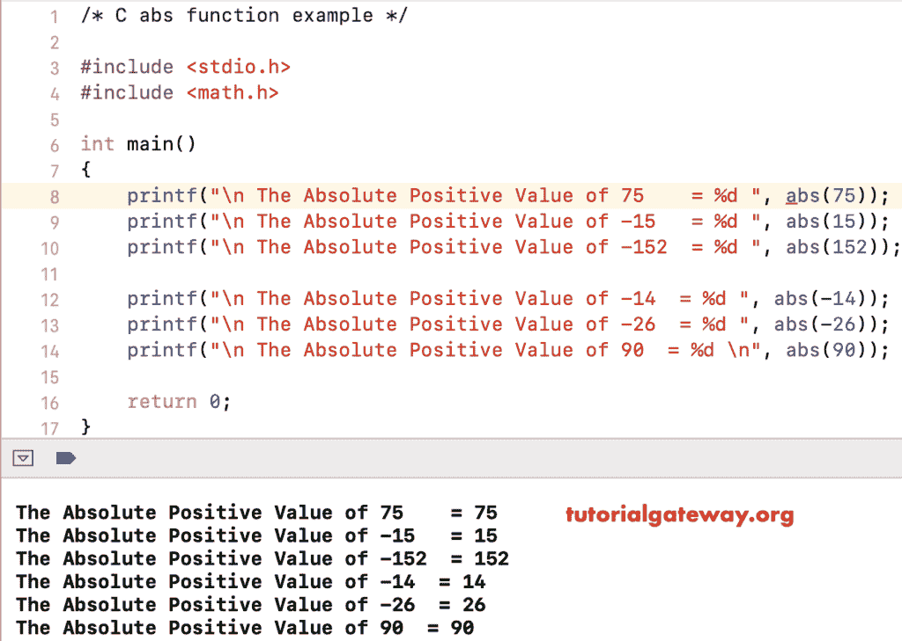

# C 语言`abs()`函数

> 原文：<https://www.tutorialgateway.org/c-abs-function/>

C`abs()`函数是数学方法之一，用于返回给定数字的绝对正值。C 语言中 abs 的语法如下所示。

```
int abs(int number);
```

## 防抱死制动系统功能示例

数学`abs()`函数允许您返回用户给定数字的绝对正整数。在这个程序中，我们将找到相同的并显示输出。

```
# include <stdio.h>
# include <math.h>

int main()
{
    printf("\n The Absolute Positive Value of 75    = %d ", abs(75));
    printf("\n The Absolute Positive Value of -15   = %d ", abs(15));
    printf("\n The Absolute Positive Value of -152  = %d ", abs(152));

    printf("\n The Absolute Positive Value of -14  = %d ", abs(-14));
    printf("\n The Absolute Positive Value of -26  = %d ", abs(-26));
    printf("\n The Absolute Positive Value of 90  = %d \n", abs(90));

    return 0;
}
```



## C 示例 2 中的绝对函数

在这个 [C 语言](https://www.tutorialgateway.org/c-programming/)的例子中，我们允许用户输入他们的值。接下来，我们这个[程序](https://www.tutorialgateway.org/c-programming-examples/)使用 abs 数学函数来求绝对正数。

```
/* abs in C Programming Example */

# include <stdio.h>
# include <math.h> 

int main()
{
    int number;

    printf(" Please Enter any Numeric Value :  ");
    scanf("%d", &number);

    printf("\n The Absolute Positive Value of %d = %d \n", number, abs(number));

    return 0;
}
```

```
 Please Enter any Numeric Value :  -987

  The Absolute Positive Value of -987 = 987
```