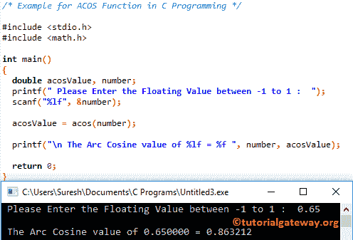

# C 语言中的`acos()`函数

> 原文：<https://www.tutorialgateway.org/acos-function-in-c/>

`acos()`函数是一个数学库函数。它用于为用户指定的表达式或值计算三角弧余弦值。C 语言中 acos 的语法是

```
double acos(double number);
```

## C 例子中的`acos()`函数

数学库中的`acos()`函数帮助您找到指定值的三角弧余弦。这个程序，要求用户输入他/她自己的号码，然后它会找到用户输入的一个余弦值

提示:请参考 [C 语言](https://www.tutorialgateway.org/c-programming/)中[余弦](https://www.tutorialgateway.org/cos-function-in-c/)一文，计算指定[程序](https://www.tutorialgateway.org/c-programming-examples/)表达式的余弦值。

```
/* Example for ACOS Function in C Programming */

# include <stdio.h>
# include <math.h>

int main()
{
  double acosValue, number;

  printf(" Please Enter the Floating Value between -1 to 1 :  ");
  scanf("%lf", &number);

  acosValue = acos(number);

  printf("\n The Arc Cosine value of %lf = %f ", number, acosValue);

  return 0;
}
```

