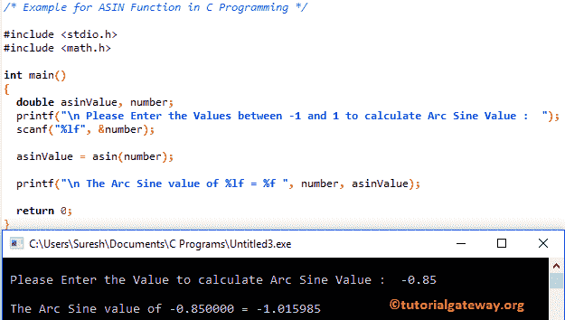

# C 语言中的 ASIN 函数

> 原文：<https://www.tutorialgateway.org/asin-function-c/>

C ASIN 函数是一个 C 数学库函数，用于计算指定表达式或值的三角弧正弦值。C 语言中 asin 的语法是

```
double asin(double number);
```

## C 示例中的 ASIN 函数

asin 数学函数可帮助您找到用户指定值的三角反正弦。

这个 asin [程序](https://www.tutorialgateway.org/c-programming-examples/)要求用户输入他/她自己的值。然后它会找到用户输入的反正弦值。请参考 [C 正弦函数](https://www.tutorialgateway.org/sin-function-in-c/)一文计算指定表达式的正弦值

```
/* Example for ASIN Function in C Programming */

#include <stdio.h>
#include <math.h>

int main()
{
  double asinValue, number;
  printf("\n Please Enter the Values between -1 and 1 to calculate Arc Sine Value :  ");
  scanf("%lf", &number);

  asinValue = asin(number);

  printf("\n The Arc Sine value of %lf = %f ", number, asinValue);

  return 0;
}
```

