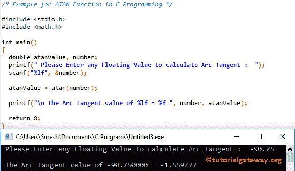

# C 语言中的 ATAN 函数

> 原文：<https://www.tutorialgateway.org/atan-function-c/>

ATAN 函数是一个数学库函数。它用于计算指定表达式或值的三角学反正切值。C 语言中 atan 的语法是

```
double atan(double number);
```

## C 例子中的 ATAN 函数

数学库中的 atan 函数可帮助您找到指定值的三角反正切。这个[程序](https://www.tutorialgateway.org/c-programming-examples/)，要求用户输入自己的值，然后找到用户输入的反正切值

提示:请参考 [C 语言](https://www.tutorialgateway.org/c-programming/)中的 [C TAN 函数](https://www.tutorialgateway.org/tan-function-in-c/)一文，计算指定表达式的正切值。

```
#include <stdio.h>
#include <math.h>

int main()
{
  double atanValue, number;
  printf(" Please Enter any Floating Value to calculate Arc Tangent :  ");
  scanf("%lf", &number);

  atanValue = atan(number);

  printf("\n The Arc Tangent value of %lf = %f ", number, atanValue);

  return 0;
}
```

