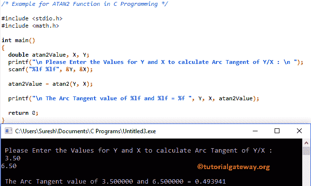

# C 语言中的`atan2()`函数

> 原文：<https://www.tutorialgateway.org/atan2-function-in-c/>

C`atan2()`函数是一个 C 数学库函数，用于计算 y/x 的三角反正切。或者你可以说它返回从 X 轴到指定点(y，X)的半径角度。C 语言中 atan2 的语法是

```
double atan2(double y, double x);
```

## C 示例中的`atan2()`函数

数学库中的`atan2()`函数可以帮助你找到多个参数的三角反正切。这个程序，要求用户输入两个值，然后找到这两个参数的反正切值

提示:请参考[C TAN](https://www.tutorialgateway.org/tan-function-in-c/)[C ATAN](https://www.tutorialgateway.org/atan-function-c/)文章，查看[程序](https://www.tutorialgateway.org/c-programming-examples/)计算指定 [C 语言](https://www.tutorialgateway.org/c-programming/)表达式的切线和反正切值。

```
# include <stdio.h>
# include <math.h>

int main()
{
  double atan2Value, X, Y;
  printf("\n Please Enter the Values for Y and X to calculate Arc Tangent of Y/X : \n ");
  scanf("%lf %lf", &Y, &X);

  atan2Value = atan2(Y, X);

  printf("\n The Arc Tangent value of %lf and %lf = %f ", Y, X, atan2Value);

  return 0;
}
```

