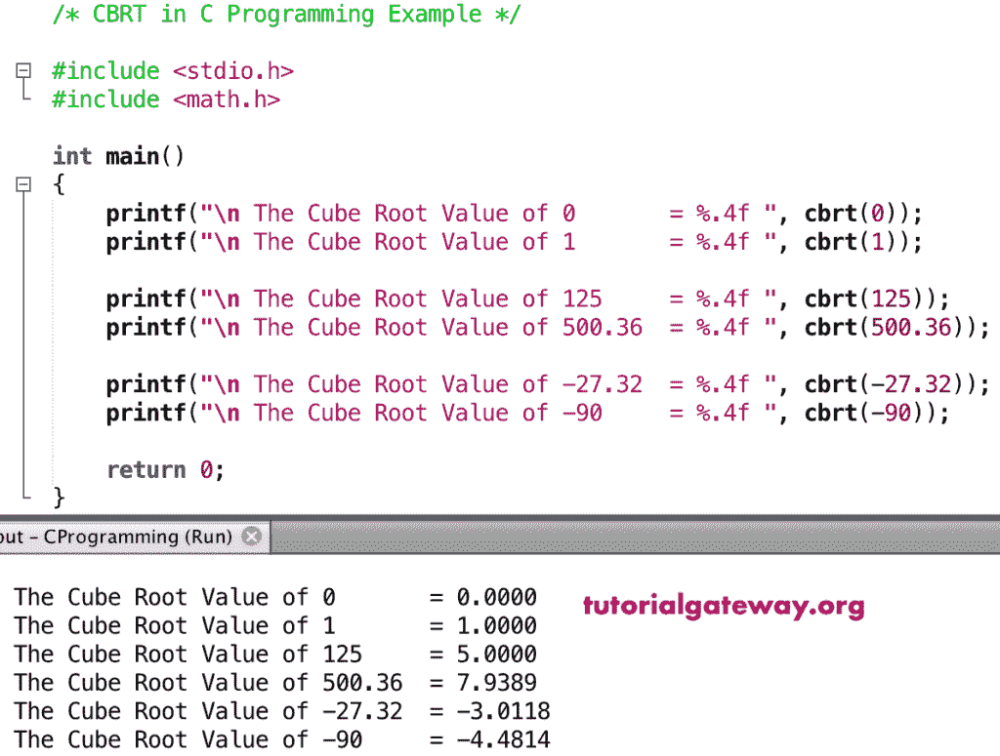

# cbrt 函数

> 原文:[https://www.tutorialgateway.org/c-cbrt-function/](https://www.tutorialgateway.org/c-cbrt-function/)

C cbrt 函数是数学函数中的一个，用来求一个数或一个指定表达式的立方根。C 语言中 cbrt 的语法如下所示。下面的函数将接受一个正值并返回它的立方根。

```
double cbrt(double number);
```

## cbrt 函数示例

数学 cbrt 函数允许你找到给定数字的立方根。在这个程序中，我们将找到立方根并显示输出。

```
//* CBRT in C Programming Example */

#include <stdio.h>
#include <math.h>

int main()
{
    printf("\n The Cube Root Value of 0       = %.4f ", cbrt(0));
    printf("\n The Cube Root Value of 1       = %.4f ", cbrt(1));

    printf("\n The Cube Root Value of 125     = %.4f ", cbrt(125));
    printf("\n The Cube Root Value of 500.36  = %.4f ", cbrt(500.36));

    printf("\n The Cube Root Value of -27.32  = %.4f ", cbrt(-27.32));  
    printf("\n The Cube Root Value of -90     = %.4f ", cbrt(-90));

    return 0;
}
```



## 立方根示例 2

在这个 [C 语言](https://www.tutorialgateway.org/c-programming/)的例子中，我们允许用户输入自己的值。接下来，这个[程序](https://www.tutorialgateway.org/c-programming-examples/)使用 cbrt 函数来找到这个数的立方根。

```
/* CBRT in C Programming Example */

#include <stdio.h>
#include <math.h>

int main()
{
    float number, cubeValue;

    printf(" Please Enter any Numeric Value :  ");
    scanf("%f", &number);

    cubeValue = cbrt(number);

    printf("\n The Cube Root Value of %.2f = %.4f ", number, cubeValue);

    return 0;
}
```

```
 Please Enter any Numeric Value :  125

 The Cube Root Value of 125.00 = 5.0000 
```