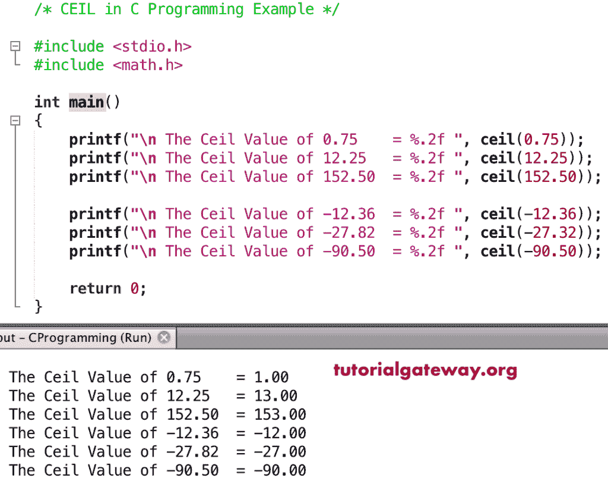

# 天花板功能

> 原文:[https://www.tutorialgateway.org/c-ceil-function/](https://www.tutorialgateway.org/c-ceil-function/)

C 天花板函数是 C 数学函数之一，用于返回大于或等于给定数字或指定表达式的最小整数值。C 程序设计中天花板的语法是

```
double ceil(double number);
```

## 天花板功能示例

这个数学函数允许你找到最小的整数值，它大于或等于一个给定的数字。在这个程序中，我们将找到上限值并显示输出。

```
/* CEIL in C Programming Example */

#include <stdio.h>
#include <math.h>

int main()
{
    printf("\n The Ceil Value of 0.75    = %.2f ", ceil(0.75));
    printf("\n The Ceil Value of 12.25   = %.2f ", ceil(12.25));    
    printf("\n The Ceil Value of 152.50  = %.2f ", ceil(152.50));

    printf("\n The Ceil Value of -12.36  = %.2f ", ceil(-12.36)); 
    printf("\n The Ceil Value of -27.82  = %.2f ", ceil(-27.32));  
    printf("\n The Ceil Value of -90.50  = %.2f ", ceil(-90.50));

    return 0;
}
```



## 数学上限示例 2

在这个 [C 语言](https://www.tutorialgateway.org/c-programming/)的例子中，我们允许用户输入自己的值。接下来，[程序](https://www.tutorialgateway.org/c-programming-examples/)使用天花板函数寻找最接近的数字。

```
#include <stdio.h>
#include <math.h> 

int main()
{
    float number, ceilValue;

    printf(" Please Enter any Numeric :  ");
    scanf("%f", &number);

    ceilValue = ceil(number);

    printf("\n The Ceiling of %.2f = %.4f ", number, ceilValue);

    return 0;
}
```

```
 Please Enter any Numeric :  256.09

 The Ceiling of 256.09 = 257.0000 
```