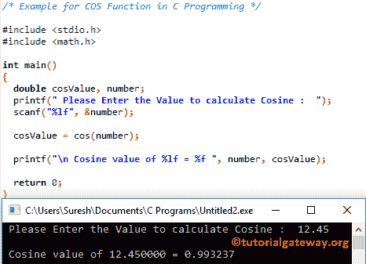

# C 语言中的 COS 函数

> 原文:[https://www.tutorialgateway.org/cos-function-in-c/](https://www.tutorialgateway.org/cos-function-in-c/)

cos 函数是一个 C 数学库函数，用于计算指定表达式的三角余弦值。C 语言中 cos 的语法是

```
double cos(double number);
```

C 中的 COS 函数将返回-1 到 1 之间的值。在我们进入语法之前，让我们看看这个三角学余弦函数背后的数学公式:

cos(x) =邻边长度/斜边长度

## C 示例中的 COS 函数

数学库中的 cos 函数允许您找到指定值的三角余弦。

这个 [C 程序](https://www.tutorialgateway.org/c-programming-examples/)，要求用户输入自己的值，然后它会找到用户指定的余弦值

提示:请参考 [C 语言](https://www.tutorialgateway.org/c-programming/)中 [C ACOS 函数](https://www.tutorialgateway.org/acos-function-in-c/)一文，计算指定表达式的弧余弦。

```
/* Example for COS Function in C Programming */

#include <stdio.h>
#include <math.h>

int main()
{
  double cosValue, number;
  printf(" Please Enter the Value to calculate Cosine :  ");
  scanf("%lf", &number);

  cosValue = cos(number);

  printf("\n Cosine value of %lf = %f ", number, cosValue);

  return 0;
}
```



## 余弦函数示例 2

在这个余弦函数的例子中，我们允许用户输入度数。然后我们把度数转换成弧度。最后，我们找到弧度的余弦值。

```
/* Example for COS Function in C Programming */

#include <stdio.h>
#include <math.h>

#define PI 3.14
int main()
{
  double cosValue, radianVal, degreeVal;
  printf(" Please Enter an Angle in degrees :  ");
  scanf("%lf", &degreeVal);

  // Convert Dgree Value to Radian 
  radianVal = degreeVal * (PI/180);
  cosValue = cos(radianVal);

  printf("\n Cosine value of %f = %f ", degreeVal, cosValue);

  return 0;
}
```

```
 Please Enter an Angle in degrees :  35

 Cosine value of 35.000000 = 0.819330
```