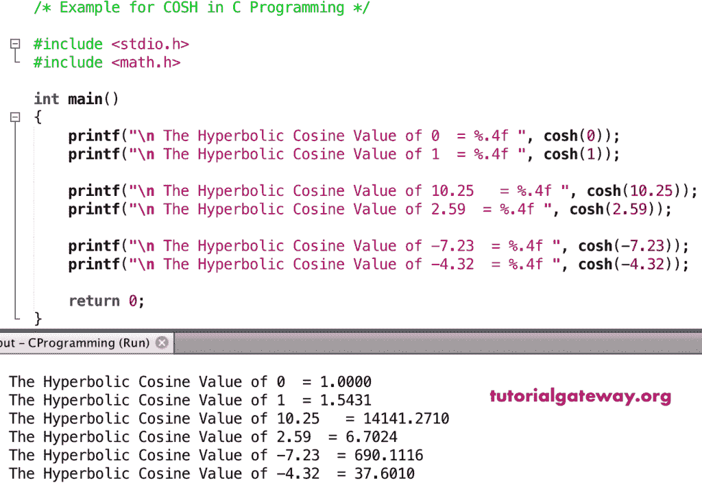

# `cosh()`函数

> 原文：<https://www.tutorialgateway.org/c-cosh-function/>

C`cosh()`函数是一个数学函数，用于计算给定值或指定表达式的三角双曲余弦。C 语言中 cosh 的语法是

```
double cosh(double number);
```

## `cosh()`函数示例

数学`cosh()`函数允许你找到给定值的双曲余弦。在这个程序中，我们将找到不同数据类型值的双曲余弦，并显示输出。

```
/* Example for COSH in C Programming */

#include <stdio.h>
#include <math.h>

int main()
{ 
    printf("\n The Hyperbolic Cosine Value of 0  = %.4f ", cosh(0));
    printf("\n The Hyperbolic Cosine Value of 1  = %.4f ", cosh(1));

    printf("\n The Hyperbolic Cosine Value of 10.25   = %.4f ", cosh(10.25));
    printf("\n The Hyperbolic Cosine Value of 2.59  = %.4f ", cosh(2.59));

    printf("\n The Hyperbolic Cosine Value of -7.23  = %.4f ", cosh(-7.23));
    printf("\n The Hyperbolic Cosine Value of -4.32  = %.4f ", cosh(-4.32));

    return 0;
}
```



## 实施例 2

在这个 [C 语言](https://www.tutorialgateway.org/c-programming/)的例子中，我们允许用户输入他们的值。接下来，这个[程序](https://www.tutorialgateway.org/c-programming-examples/)使用`cosh()`函数找到用户给定数字的双曲余弦。

```
/* Example for COSH in C Programming */

#include <stdio.h>
#include <math.h>

int main()
{
    float number, coshValue;

    printf(" Please Enter any Numeric Value :  ");
    scanf("%f", &number);

    coshValue = cosh(number);

    printf("\n The Hyperbolic Cosine Value of %.2f = %.4f ", number, coshValue);

    return 0;
}
```

```
 Please Enter any Numeric Value :  9.34

 The Hyperbolic Cosine Value of 9.34 = 5692.2051 
```