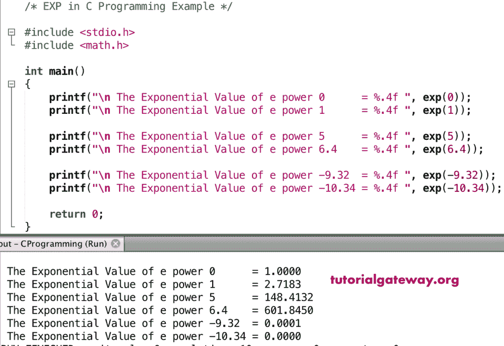

# 扩展函数

> 原文：<https://www.tutorialgateway.org/c-exp-function/>

C exp 函数是数学函数之一，用于返回 E 的给定值或指定表达式的幂。这里 E 是欧拉数，近似等于 2.71828。C 语言中 exp 的基本语法是

```
double exp(double number);
```

## C exp 函数示例

数学 exp 函数允许你找到 2.71828 的给定值的幂。在这个程序中，我们将找到相同的，并显示输出。

```
/* EXP in C Programming Example */

#include <stdio.h>
#include <math.h>

int main()
{
    printf("\n The Exponential Value of e power 0      = %.4f ", exp(0));
    printf("\n The Exponential Value of e power 1      = %.4f ", exp(1));

    printf("\n The Exponential Value of e power 5      = %.4f ", exp(5));
    printf("\n The Exponential Value of e power 6.4    = %.4f ", exp(6.4));

    printf("\n The Exponential Value of e power -9.32  = %.4f ", exp(-9.32));  
    printf("\n The Exponential Value of e power -10.34 = %.4f ", exp(-10.34));

    return 0;
}
```



## 实验例 2

在这个 [C 语言](https://www.tutorialgateway.org/c-programming/)的例子中，我们提供给用户输入自己的值。下一步，[程序](https://www.tutorialgateway.org/c-programming-examples/)使用 exp 函数找到 E 的幂用户给定的数字。

```
/* EXP in C Programming Example */

#include <stdio.h>
#include <math.h> 

int main()
{
    float number, expValue;

    printf(" Please Enter any Numeric Value :  ");
    scanf("%f", &number);

    expValue = exp(number);

    printf("\n Exponential Value of e power %.2f = %.4f ", number, expValue);

    return 0;
}
```

```
 Please Enter any Numeric Value :  4.25

 Exponential Value of e power 4.25 = 70.1054
```