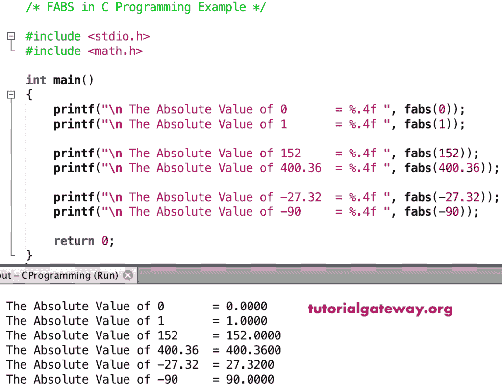

# C 语言`fabs()`函数

> 原文：<https://www.tutorialgateway.org/c-fabs-function/>

C`fabs()`函数是 C 数学函数之一，用于返回给定值或指定表达式的绝对正数。C 语言中晶圆厂的语法是

```c
double fabs(double number);
```

## `fabs()`函数示例

数学绝对函数允许你返回绝对正数。在这个数学晶圆厂程序中，我们将找到不同值的绝对正数，并显示输出。

```c
/* FABS in C Programming Example */

#include <stdio.h>
#include <math.h>

int main()
{
    printf("\n The Absolute Value of 0       = %.4f ", fabs(0));
    printf("\n The Absolute Value of 1       = %.4f ", fabs(1));

    printf("\n The Absolute Value of 152     = %.4f ", fabs(152));
    printf("\n The Absolute Value of 400.36  = %.4f ", fabs(400.36));

    printf("\n The Absolute Value of -27.32  = %.4f ", fabs(-27.32));  
    printf("\n The Absolute Value of -90     = %.4f ", fabs(-90));

    return 0;
}
```



## 晶圆厂示例 2

在这个 [C 语言](https://www.tutorialgateway.org/c-programming/)的例子中，我们允许用户输入自己的值。接下来，这个[程序](https://www.tutorialgateway.org/c-programming-examples/)使用`fabs()`函数找到用户给定值的绝对正数。

```c
//* FABS in C Programming Example */

#include <stdio.h>
#include <math.h>

int main()
{
    float number, absValue;

    printf(" Please Enter any Numeric Value :  ");
    scanf("%f", &number);

    absValue = fabs(number);

    printf("\n The Absolute Value of %.2f = %.4f ", number, absValue);

    return 0;
}
```

```c
 Please Enter any Numeric Value :  -23.456

 The Absolute Value of -23.46 = 23.4560
```