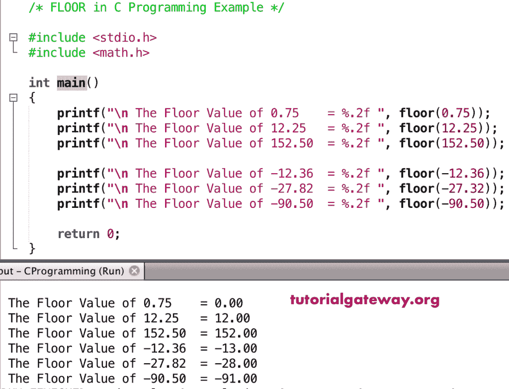

# 楼层功能

> 原文：<https://www.tutorialgateway.org/c-floor-function/>

C 楼函数是数学函数之一，用于返回小于或等于给定数字的最接近的整数值。C 语言中数学层的语法是

```
double floor(double number);
```

## 楼层功能示例

数学地板函数允许您查找最接近的整数值，该值小于或等于用户给定的数字。在这个程序中，我们将找到相同的并显示输出 [C 语言](https://www.tutorialgateway.org/c-programming/)。

```
#include <stdio.h>
#include <math.h>

int main()
{
    printf("\n The Floor Value of 0.75    = %.2f ", floor(0.75));
    printf("\n The Floor Value of 12.25   = %.2f ", floor(12.25));    
    printf("\n The Floor Value of 152.50  = %.2f ", floor(152.50));

    printf("\n The Floor Value of -12.36  = %.2f ", floor(-12.36)); 
    printf("\n The Floor Value of -27.82  = %.2f ", floor(-27.32));  
    printf("\n The Floor Value of -90.50  = %.2f ", floor(-90.50));

    return 0;
}
```



在这个[程序](https://www.tutorialgateway.org/c-programming-examples/)中，我们使用了 floor 函数来查找用户输入值的最接近的数字。

```
/* FLOOR in C Programming Example */

#include <stdio.h>
#include <math.h>

int main()
{
    float number, floorValue;

    printf(" Please Enter any Numeric :  ");
    scanf("%f", &number);

    floorValue = floor(number);

    printf("\n The Floor of %.2f = %.4f ", number, floorValue);

    return 0;
}
```

```
 Please Enter any Numeric :  125.87

 The Floor of 125.87 = 125.0000
```