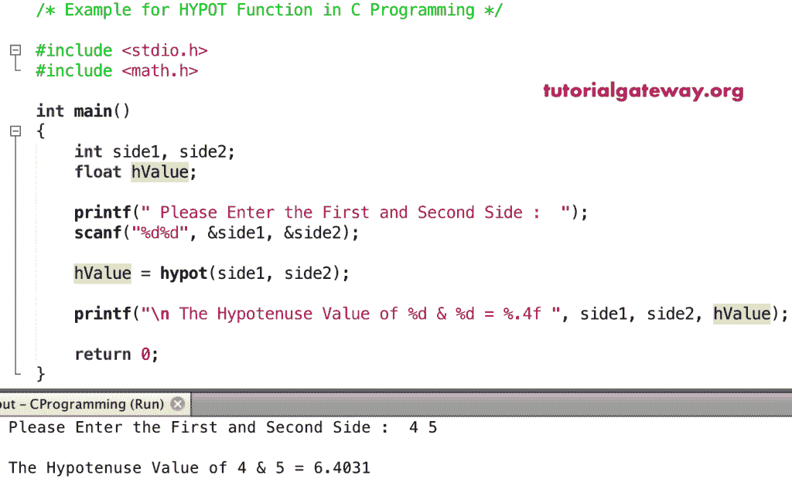

# C 语言`hypot()`函数

> 原文：<https://www.tutorialgateway.org/c-hypot-function/>

`hypot()`函数是一个数学函数，用于计算给定两边的三角斜边值。C 语言中函数的语法是

```c
double hypot(double number);
```

假设=两边平方和的平方根(指定参数)。

## `hypot()`函数示例

数学`hypot()`函数允许你找到给定边的斜边值。在这个[程序](https://www.tutorialgateway.org/c-programming-examples/)中，我们要找到斜边并显示输出。

```c
/* Example for HYPOT in C Programming */

# include <stdio.h>
# include <math.h>

int main()
{ 
    printf("\n The Hypotenuse Value of 10 & 0  = %.4f ", hypot(10, 0));
    printf("\n The Hypotenuse Value of 0 & -5  = %.4f ", hypot(0, -5));

    printf("\n The Hypotenuse Value of 5 & -2  = %.4f ", hypot(5, -2));
    printf("\n The Hypotenuse Value of -2 & 10 = %.4f ", hypot(-2, 10));

    printf("\n The Hypotenuse Value of 10 & 12 = %.4f ", hypot(10, 12));
    printf("\n The Hypotenuse Value of 5 & 20  = %.4f ", hypot(5, 20));

    return 0;
}
```

```c
 The Hypotenuse Value of 10 & 0  = 10.0000 
 The Hypotenuse Value of 0 & -5  = 5.0000 
 The Hypotenuse Value of 5 & -2  = 5.3852 
 The Hypotenuse Value of -2 & 10 = 10.1980 
 The Hypotenuse Value of 10 & 12 = 15.6205 
 The Hypotenuse Value of 5 & 20  = 20.6155
```

## 海波实例 2

在这个 [C 语言](https://www.tutorialgateway.org/c-programming/)的例子中，我们允许用户输入他们的三角形的两边。接下来，我们使用`hypot()`函数来寻找用户给定边的斜边。

```c
/* Example for HYPOT in C Programming */

# include <stdio.h>
# include <math.h>

int main()
{
    int side1, side2;
    float hValue;

    printf(" Please Enter the First and Second Side :  ");
    scanf("%d%d", &side1, &side2);

    hValue = hypot(side1, side2);

    printf("\n The Hypotenuse Value of %d & %d = %.4f ", side1, side2, hValue);

    return 0;
}
```

