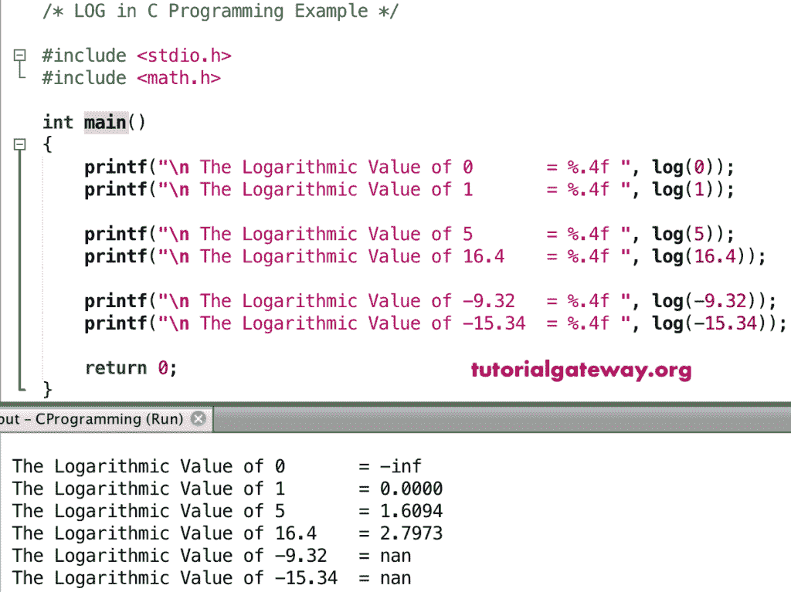

# 对数函数

> 原文：<https://www.tutorialgateway.org/c-log-function/>

C log 函数是数学函数之一，用来计算给定的以 e 为基数的数的对数值

```
double log(double number);
```

## 日志函数示例

C 数学对数函数可以让你找到 e 基数的对数值，在这个程序中，我们要找到不同数字的对数值，并显示输出。

```
#include <stdio.h>
#include <math.h>

int main()
{
    printf("\n The Logarithmic Value of 0       = %.4f ", log(0));
    printf("\n The Logarithmic Value of 1       = %.4f ", log(1));

    printf("\n The Logarithmic Value of 5       = %.4f ", log(5));
    printf("\n The Logarithmic Value of 16.4    = %.4f ", log(16.4));

    printf("\n The Logarithmic Value of -9.32   = %.4f ", log(-9.32));  
    printf("\n The Logarithmic Value of -15.34  = %.4f ", log(-15.34));

    return 0;
}
```



在这个 [C 语言](https://www.tutorialgateway.org/c-programming/)的例子中，我们允许用户输入自己的号码。接下来，这个[程序](https://www.tutorialgateway.org/c-programming-examples/)使用对数函数来寻找以 e 为基数的用户给定数字的对数值

```
#include <stdio.h>
#include <math.h>

int main()
{
    float num, logValue;

    printf(" Please Enter any Numeric :  ");
    scanf("%f", &num);

    logValue = log(num);

    printf("\n Logarithmic of %.2f = %.4f ", num, logValue);

    return 0;
}
```

```
 Please Enter any Numeric :  25.765

 Logarithmic of 25.76 = 3.2490
```