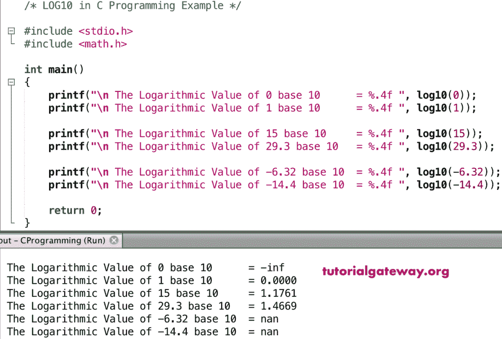

# C 语言`log10()`函数

> 原文：<https://www.tutorialgateway.org/c-log10-function/>

C`log10()`函数是 C 数学函数之一，用于计算基数为 10 的数的对数值。C 语言中数学日志 10 的语法是

```c
double log10(double number);
```

## C`log10()`函数示例

数学`log10()`函数允许你找到基数为 10 的对数值。在这个程序中，我们将找到 log10 值并显示输出。

```c
/* LOG10 in C Programming Example */

# include <stdio.h>
# include <math.h> 

int main()
{
    printf("\n The Logarithmic Value of 0 base 10      = %.4f ", log10(0));
    printf("\n The Logarithmic Value of 1 base 10      = %.4f ", log10(1));

    printf("\n The Logarithmic Value of 15 base 10     = %.4f ", log10(15));
    printf("\n The Logarithmic Value of 29.3 base 10   = %.4f ", log10(29.3));

    printf("\n The Logarithmic Value of -6.32 base 10  = %.4f ", log10(-6.32));  
    printf("\n The Logarithmic Value of -14.4 base 10  = %.4f ", log10(-14.4));

    return 0;
}
```



## 日志 10 示例 2

在这个 [C 语言](https://www.tutorialgateway.org/c-programming/)的例子中，我们允许用户输入自己的值。接下来，[程序](https://www.tutorialgateway.org/c-programming-examples/)使用`log10()`函数找到以 10 为基数的用户给定数字的对数值。

```c
/* LOG10 in C Programming Example */

# include <stdio.h>
# include <math.h>

int main()
{
    float number, logValue;

    printf(" Please Enter any Numeric Value :  ");
    scanf("%f", &number);

    logValue = log10(number);

    printf("\n Logarithmic Value of %.2f base 10 = %.4f ", number, logValue);

    return 0;
}
```

```c
 Please Enter any Numeric Value :  98.567

 Logarithmic Value of 98.57 base 10 = 1.9937
```