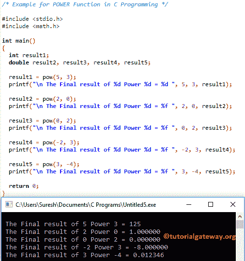

# C 语言`pow()`函数

> 原文：<https://www.tutorialgateway.org/pow-in-c-programming/>

用于计算指定值的幂的`pow()`函数。例如，如果 x 是基值，2 是指数，那么 pow (x，2) = x

```c
double pow(double base, double Exponent);
```

*   请在此指定基值和指数指数值或幂。

## C 语言编程中的 POW 示例

c 语言中的`pow()`函数，用于返回给定数的幂。在这个程序中，我们将找到正值和负值的幂，并使用 C 语言中的幂和 printf 语句显示输出

```c
# include <stdio.h>
# include <math.h>

int main()
{
  int result1; 
  double result2, result3, result4, result5;

  result1 = pow(5, 3);
  printf("\n The Final result of %d Power %d = %d ", 5, 3, result1);

  result2 = pow(2, 0);
  printf("\n The Final result of %d Power %d = %f ", 2, 0, result2);

  result3 = pow(0, 2);
  printf("\n The Final result of %d Power %d = %f ", 0, 2, result3);

  result4 = pow(-2, 3);
  printf("\n The Final result of %d Power %d = %f ", -2, 3, result4);

  result5 = pow(3, -4);
  printf("\n The Final result of %d Power %d = %f ", 3, -4, result5);

  return 0;
}
```



### C 语言`pow()`函数示例 2

这个[程序](https://www.tutorialgateway.org/c-programming-examples/)要求用户输入他/她自己的基数和指数值。然后它将计算用户指定值的幂

```c
# include <stdio.h>
# include <math.h>

int main()
{
  int result, base, exponent;

  printf("\n Please Enter the Base and Exponent Values : \n ");
  scanf("%d %d", &base, &exponent);

  result = pow(base, exponent);

  printf("\n The Final result of %d Power %d = %d ", base, exponent, result);

  return 0;
}
```

```c
 Please Enter the Base and Exponent Values :  
 2
 5

 The Final result of 2 Power 5 = 32
```