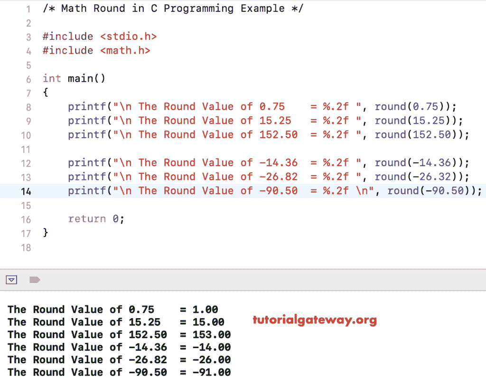

# c `round()`函数

> 原文：<https://www.tutorialgateway.org/c-round-function/>

C`round()`函数是数学函数之一，用于返回给定数字或指定表达式的最近值(舍入值)。数学舍入函数的语法是

```
double round(double round);
```

## c `round()`函数示例

数学舍入函数允许您找到给定数字的最接近的整数值。在这个程序中，我们将找到不同数字的最接近的整数值，并显示输出。

```
/* round in C Programming Example */

# include <stdio.h>
# include <math.h>

int main()
{
    printf("\n The Round Value of 0.75    = %.2f ", round(0.75));
    printf("\n The Round Value of 15.25   = %.2f ", round(15.25));
    printf("\n The Round Value of 152.50  = %.2f ", round(152.50));

    printf("\n The Round Value of -14.36  = %.2f ", round(-14.36));
    printf("\n The Round Value of -26.82  = %.2f ", round(-26.32));
    printf("\n The Round Value of -90.50  = %.2f \n", round(-90.50));

    return 0;
}
```



## c 数学回合示例 2

在这个 [C 语言](https://www.tutorialgateway.org/c-programming/)的例子中，我们允许用户输入自己的值。接下来，这个[程序](https://www.tutorialgateway.org/c-programming-examples/)使用舍入函数来寻找舍入(最近的)值。

```
/* round in C Programming Example */

# include <stdio.h>
# include <math.h> 

int main()
{
    float number, roundValue;

    printf(" Please Enter any Numeric Value to Round :  ");
    scanf("%f", &number);

    roundValue = round(number);

    printf("\n The Round Value of %.2f = %.4f \n", number, roundValue);

    return 0;
}
```

```
 Please Enter any Numeric Value to Round :  12.23

 The Round Value of 12.23 = 12.0000
```