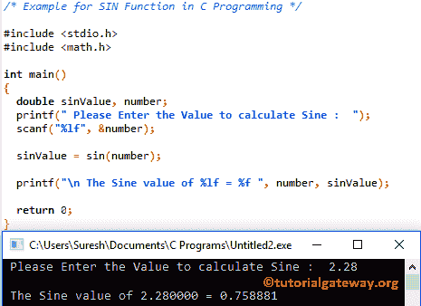

# C 语言中的`sin()`函数

> 原文：<https://www.tutorialgateway.org/sin-function-in-c/>

`sin()`函数是一个数学库函数，用于计算指定表达式的三角正弦值。C 语言中 sin 的语法是

```
double sin(double number);
```

C 中的`sin()`函数将返回-1 到 1 之间的值。在我们进入 C 语言中`sin()`函数的语法之前，让我们看看这个三角`sin()`函数背后的数学公式:

sin(x) =对边长度/斜边长度

## C 例子中的`sin()`函数

数学库中的`sin()`函数允许您计算指定值的三角正弦。这个[程序](https://www.tutorialgateway.org/c-programming-examples/)，要求用户输入自己的值，然后它会找到用户指定值的正弦值

提示:请参考 [C`asin()`函数](https://www.tutorialgateway.org/asin-function-c/)一文计算指定表达式的反正弦。

```
/* Example for SIN Function in C Programming */

# include <stdio.h>
# include <math.h>

int main()
{
  double sinValue, number;
  printf(" Please Enter the Value to calculate Sine :  ");
  scanf("%lf", &number);

  sinValue = sin(number);

  printf("\n The Sine value of %lf = %f ", number, sinValue);

  return 0;
}
```



## `sin()`函数示例 2

这个 [C 语言](https://www.tutorialgateway.org/c-programming/)的例子允许用户输入度数，然后我们将度数转换成弧度。最后，我们找到弧度的正弦值

```
/* Example for SIN Function in C Programming */

# include <stdio.h>
# include <math.h>

# define PI 3.14159
int main()
{
  double sinValue, radianVal, degreeVal;
  printf(" Please Enter an Angle in degrees :  ");
  scanf("%lf", &degreeVal);

  // Convert Degree Value to Radian 
  radianVal = degreeVal * (PI/180);
  sinValue = sin(radianVal);

  printf("\n The Sine value of %f = %f ", degreeVal, sinValue);

  return 0;
}
```

```
 Please Enter an Angle in degrees :  30

 The Sine value of 30.000000 = 0.500000
```