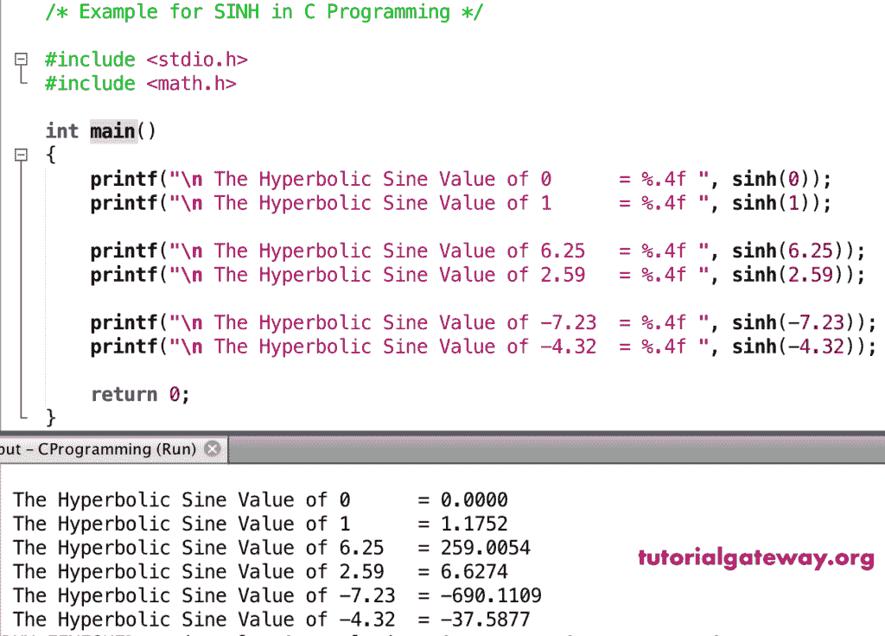

# 正弦函数

> 原文:[https://www.tutorialgateway.org/c-sinh-function/](https://www.tutorialgateway.org/c-sinh-function/)

正弦函数是一个数学函数，用于计算给定值或指定表达式的三角双曲正弦。C 语言中 sinh 的语法是

```
double sinh(double number);
```

## 正弦函数示例

数学正弦函数允许你找到给定值的双曲正弦。在这个程序中，我们将找到不同值的双曲正弦，并显示输出。

```
/* Example for SINH in C Programming */

#include <stdio.h>
#include <math.h>

int main()
{ 
    printf("\n The Hyperbolic Sine Value of 0      = %.4f ", sinh(0));
    printf("\n The Hyperbolic Sine Value of 1      = %.4f ", sinh(1));

    printf("\n The Hyperbolic Sine Value of 6.25   = %.4f ", sinh(6.25));
    printf("\n The Hyperbolic Sine Value of 2.59   = %.4f ", sinh(2.59));

    printf("\n The Hyperbolic Sine Value of -7.23  = %.4f ", sinh(-7.23));
    printf("\n The Hyperbolic Sine Value of -4.32  = %.4f ", sinh(-4.32));

    return 0;
}
```



## 实施例 2

在这个 [C 语言](https://www.tutorialgateway.org/c-programming/)的例子中，我们允许用户输入他们的值。接下来，这个[程序](https://www.tutorialgateway.org/c-programming-examples/)使用 sinh 函数找到用户给定数字的双曲正弦。

```
/* Example for SINH in C Programming */

#include <stdio.h>
#include <math.h>

int main()
{
    float number, sinhValue;

    printf(" Please Enter any Numeric Value :  ");
    scanf("%f", &number);

    sinhValue = sinh(number);

    printf("\n The Hyperbolic Sine Value of %.2f = %.4f ", number, sinhValue);

    return 0;
}
```

```
 Please Enter any Numeric Value :  12.56

 The Hyperbolic Sine Value of 12.56 = 142465.2344
```