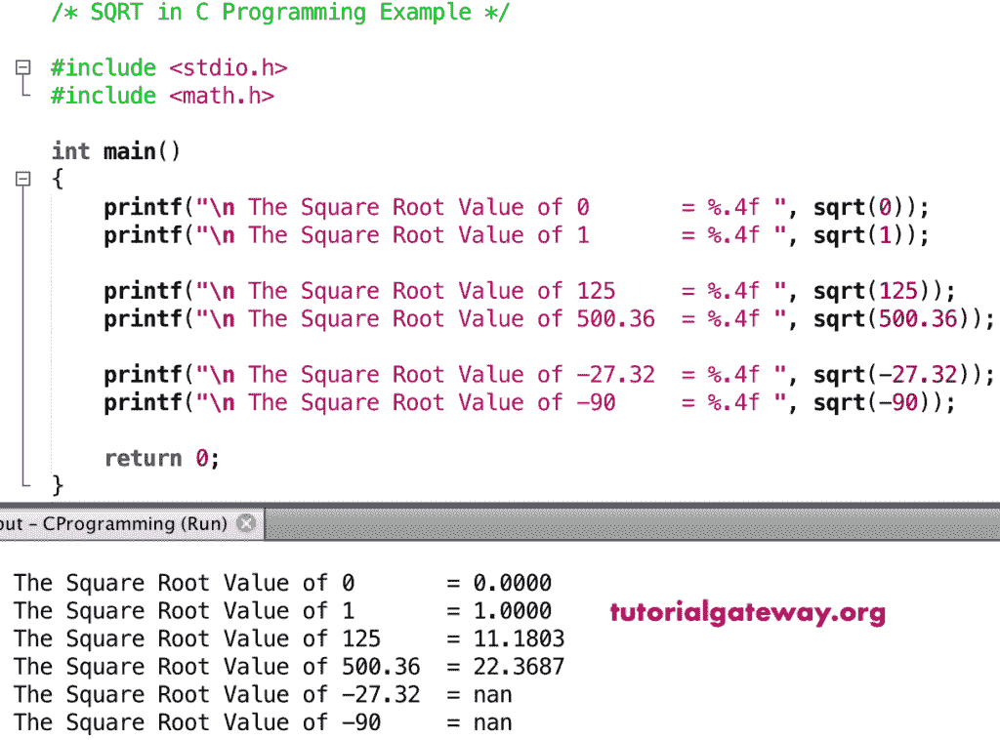

# 函数

> 原文：<https://www.tutorialgateway.org/c-sqrt-function/>

C sqrt 函数是数学函数之一，用来求一个数或一个指定表达式的平方根。C 语言中 sqrt 的语法是

```
double sqrt(double number);
```

## 函数示例

数学平方根函数允许你找到给定数字的平方根。在这个程序中，我们将找到平方根并显示输出。

```
#include <stdio.h>
#include <math.h>

int main()
{
    printf("\n The Square Root Value of 0       = %.4f ", sqrt(0));
    printf("\n The Square Root Value of 1       = %.4f ", sqrt(1));

    printf("\n The Square Root Value of 125     = %.4f ", sqrt(125));
    printf("\n The Square Root Value of 500.36  = %.4f ", sqrt(500.36));

    printf("\n The Square Root Value of -27.32  = %.4f ", sqrt(-27.32));  
    printf("\n The Square Root Value of -90     = %.4f ", sqrt(-90));

    return 0;
}
```



## 平方根示例 2

在这个 [C 语言](https://www.tutorialgateway.org/c-programming/)的例子中，我们允许用户输入自己的值。接下来，这个[程序](https://www.tutorialgateway.org/c-programming-examples/)使用 sqrt 函数来寻找用户给定数字的平方根。

```
#include <stdio.h>
#include <math.h>

int main()
{
    float number, sqrtValue;

    printf(" Please Enter any Numeric :  ");
    scanf("%f", &number);

    sqrtValue = sqrt(number);

    printf("\n The Square Root of %.2f = %.4f ", number, sqrtValue);

    return 0;
}
```

```
 Please Enter any Numeric :  64

 The Square Root of 64.00 = 8.0000
```