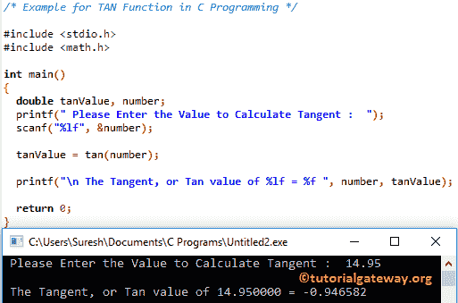

# C 语言中的 TAN 函数

> 原文:[https://www.tutorialgateway.org/tan-function-in-c/](https://www.tutorialgateway.org/tan-function-in-c/)

函数是一个数学库函数。计算指定表达式的三角正切值很有帮助。C 程序设计中 tan 的语法是

```
double tan(double number);
```

让我们看看这个三角正切函数背后的数学公式:

Tan(x) =对边的长度/邻边的长度

## C 例子中的 TAN 函数

C 数学库中的 tan 函数允许您计算指定值的三角正切值。

这个[程序](https://www.tutorialgateway.org/c-programming-examples/)要求用户输入他/她自己的值。然后它会找到用户指定值的正切值。请参考 [C ATAN 函数](https://www.tutorialgateway.org/atan-function-c/)一文计算指定表达式的反正切。

```
/* Example for TAN Function in C Programming */

#include <stdio.h>
#include <math.h>

int main()
{
  double tanValue, number;
  printf(" Please Enter the Value to Calculate Tangent :  ");
  scanf("%lf", &number);

  tanValue = tan(number);

  printf("\n The Tangent, or Tan value of %lf = %f ", number, tanValue);

  return 0;
}
```



## 切线函数示例 2

这个 [C 语言](https://www.tutorialgateway.org/c-programming/)例子允许用户输入度数。接下来，我们将度数转换为弧度。最后，我们找到弧度的正切值

```
/* Example for TAN Function in C Programming */

#include <stdio.h>
#include <math.h>

#define PI 3.1415926
int main()
{
  double tanValue, radianVal, degreeVal;
  printf(" Please Enter an Angle in degrees :  ");
  scanf("%lf", &degreeVal);

  // Convert Degree Value to Radian  
  radianVal = degreeVal * (PI/180);
  tanValue = tan(radianVal);

  printf("\n The Tangent, or Tan value of %f = %f ", degreeVal, tanValue);

  return 0;
}
```

```
 Please Enter an Angle in degrees :  60

 The Tangent, or Tan value of 60.000000 = 1.732051
```