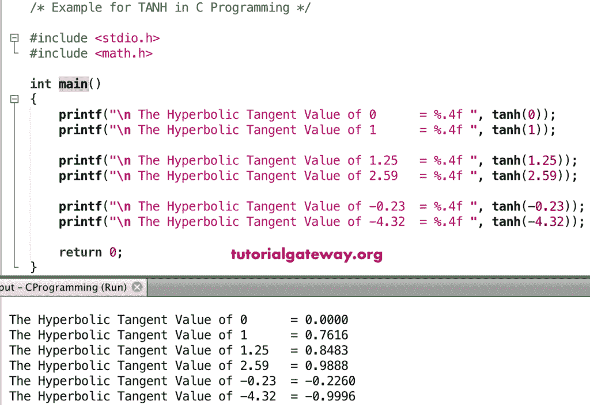

# 函数

> 原文:[https://www.tutorialgateway.org/c-tanh-function/](https://www.tutorialgateway.org/c-tanh-function/)

C tanh 函数是一个数学函数，用于计算给定值或指定表达式的三角双曲正切值。C 程序设计中 tanh 的语法是

```
double tanh(double number);
```

## 函数示例

数学正切函数允许你找到给定值的双曲正切值。在这个程序中，我们将找到不同值的双曲正切值，并显示输出。

```
/* Example for TANH in C Programming */

#include <stdio.h>
#include <math.h>

int main()
{ 
    printf("\n The Hyperbolic Tangent Value of 0      = %.4f ", tanh(0));
    printf("\n The Hyperbolic Tangent Value of 1      = %.4f ", tanh(1));

    printf("\n The Hyperbolic Tangent Value of 1.25   = %.4f ", tanh(1.25));
    printf("\n The Hyperbolic Tangent Value of 2.59   = %.4f ", tanh(2.59));

    printf("\n The Hyperbolic Tangent Value of -0.23  = %.4f ", tanh(-0.23));
    printf("\n The Hyperbolic Tangent Value of -4.32  = %.4f ", tanh(-4.32));

    return 0;
}
```



## 实施例 2

在这个 [C 语言](https://www.tutorialgateway.org/c-programming/)的例子中，我们允许用户输入他们的值。接下来，这个[程序](https://www.tutorialgateway.org/c-programming-examples/)使用 tanh 函数来寻找用户给定数字的双曲正切值。

```
/* Example for TANH in C Programming */

#include <stdio.h>
#include <math.h>

int main()
{
    float number, tanhValue;

    printf(" Please Enter any Numeric :  ");
    scanf("%f", &number);

    tanhValue = tanh(number);

    printf("\n Hyperbolic Tangent of %.2f = %.4f ", number, tanhValue);

    return 0;
}
```

```
 Please Enter any Numeric :  -2.347

 Hyperbolic Tangent of -2.35 = -0.9819
```