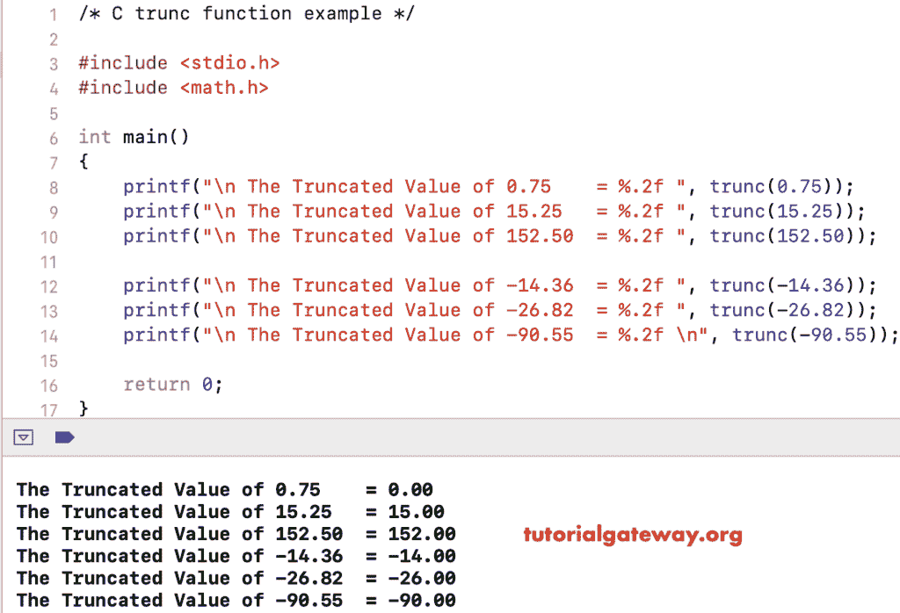

# C 语言`trunc()`函数

> 原文：<https://www.tutorialgateway.org/c-trunc-function/>

C`trunc()`函数是用于返回给定数字或指定表达式的截断值的数学函数之一。C 语言中截断函数的语法是

```
double trunc(double value);
```

## 集群功能示例

数学`trunc()`函数允许您查找给定数字的截断值。在这个程序中，我们将找到不同数字的截断值，并显示输出。

```
/* trunc in C Programming Example */

# include <stdio.h>
# include <math.h>

int main()
{
    printf("\n The Truncated Value of 0.75    = %.2f ", trunc(0.75));
    printf("\n The Truncated Value of 15.25   = %.2f ", trunc(15.25));
    printf("\n The Truncated Value of 152.50  = %.2f ", trunc(152.50));

    printf("\n The Truncated Value of -14.36  = %.2f ", trunc(-14.36));
    printf("\n The Truncated Value of -26.82  = %.2f ", trunc(-26.82));
    printf("\n The Truncated Value of -90.55  = %.2f \n", trunc(-90.55));

    return 0;
}
```



## c 截断示例 2

在这个[字符串函数](https://www.tutorialgateway.org/c-string/)的例子中，我们允许用户输入他们的值。接下来，这个[程序](https://www.tutorialgateway.org/c-programming-examples/)使用 C 语言中的这个函数来截断用户指定的值。

```
/* trunc in C Programming Example */

# include <stdio.h>
# include <math.h> 

int main()
{
    float number, trunc_Value;

    printf(" Please Enter any Numeric to Round :  ");
    scanf("%f", &number);

    trunc_Value = trunc(number);

    printf("\n The Truncated of %.2f = %.4f \n", number, trunc_Value);

    return 0;
}
```

```
 Please Enter any Numeric to Round :  234.589

 The Truncated of 234.59 = 234.0000 
```