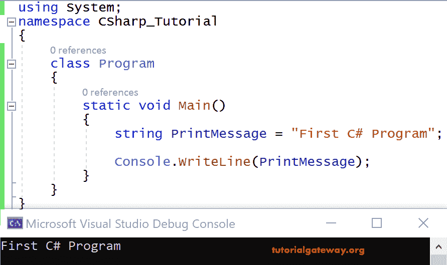
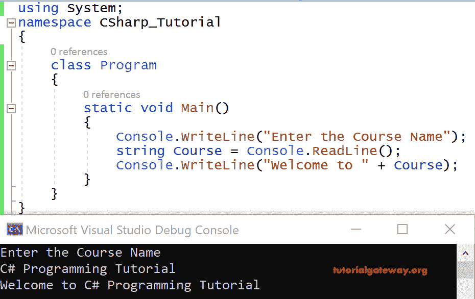
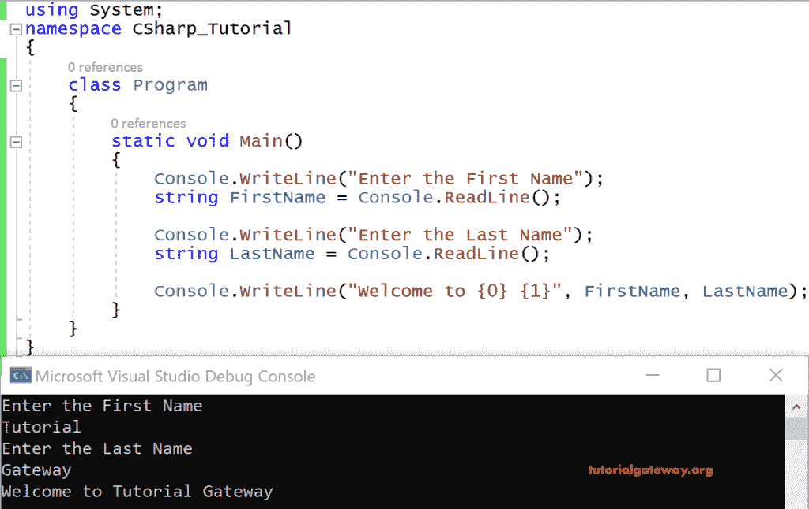

# C# 基本示例程序

> 原文：<https://www.tutorialgateway.org/csharp-basic-example-program/>

本节展示了 C# 基本程序示例，并逐行解释了程序结构。

在进入完整教程之前，让我们了解一下 C# 程序的基本结构。

```
using System;

 class Program
 {
     static void Main()
     {
         string PrintMessage = "First C# Program";

         Console.WriteLine(PrintMessage);
     }
 }
```

上面的 C# 示例程序属于一个基本或简单的 Console 应用程序。在这里，我想在命令提示符窗口上打印一条简单的消息“第一个 C# 程序”。

控制台。WriteLine()—这是这种语言的打印语句。

这里，Console 是从 System Namespace 派生的类，而 WriteLine()是 Console 类中的一个方法。

系统是命名空间，它是类、枚举、结构、接口、委托等各种东西的集合。，甚至一个命名空间也可以包含其他命名空间。

我们甚至可以在声明中使用完全限定的名称，而不是使用名称空间。即系统。console . WriteLine()；

程序是我们用来编写代码的类名。

我们在这里所做的是，我们获取了一个字符串(数据类型)变量 PrintMessage，并在其中存储了一条消息。最后通过 [C# ](https://www.tutorialgateway.org/csharp-tutorial/) 控制台上的变量打印该消息。

这是我们在控制台上显示的输出。



有两种方法可以写在 [C# ](https://www.tutorialgateway.org/csharp-tutorial/) 控制台上，我们将在接下来的例子中展示这两种方法。

## 使用连接的 C# 基本示例程序

我们编写了一个 C# 程序，要求用户输入课程名称。然后，从控制台读取课程名称后，向控制台打印一条消息。

```
using System;

   class Program
   {
     static void Main()
     {
       Console.WriteLine("Enter the Course Name");
       string Course = Console.ReadLine();
       Console.WriteLine("Welcome to " + Course);
     }
   }
```

输出



这里是控制台。ReadLine()从用户处读取课程名称，即 C# 编程教程。接下来，我们将文本存储在一个字符串变量中，当然是为了打印。

我们将字符串“欢迎使用”与来自用户的文本连接起来。即使用“+”的 C# 编程教程(连接或算术加运算符)。

### 使用占位符语法的 C# 基本示例程序

我们可以使用占位符语法打印字符串作为输出，而不是将它们串联起来。

```
Console.WriteLine("Welcome to {0} ", course);
```

这里，从字符串变量课程中读取的文本将在“{0}”处被替换。

在实时环境中，大多数占位符语法更适合打印到 C# 控制台程序上。

```
using System;

   class Program
   {
     static void Main()
     {
       Console.WriteLine("Enter the First Name");
       string FirstName = Console.ReadLine();
       Console.WriteLine("Enter the Last Name");
       string LastName = Console.ReadLine();

     Console.WriteLine("Welcome to {0} {1}", FirstName, LastName);
     }
   }
```

输出

