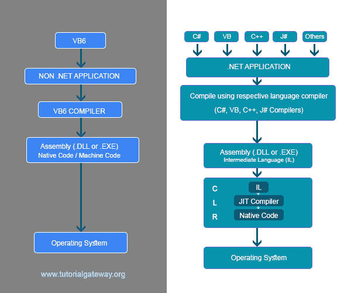

# 点网框架

> 原文：<https://www.tutorialgateway.org/dot-net-framework/>

Dot Net 框架:它是一个平台或许多技术的集合，集成为一个技术，用于开发一个强大的应用程序。点网框架可以被认为是一个多种技术/语言可以协同工作的平台。

框架:框架实际上是软件系统的平台，有助于重用预定义的代码。这意味着该框架通过支持代码库和几种脚本语言来鼓励重用。

## 非点网应用程序的执行

为了更好地理解点网框架，让我们将非点网应用程序的执行与点网应用程序进行比较。

甚至在 Dot Net 框架出现之前，我们曾经使用 VB6、VC++等开发应用程序。当这些应用程序执行时，它们各自的编译器用来生成一个具有扩展的程序集。dll 或。exe，具体取决于应用程序的类型。例如，当一个 windows 应用程序被编译时，我们会得到一个. exe。然而，当一个 web 应用程序被编译时，它会生成一个. dll 文件。

这里，VB6 或 VC++编译器的任务是生成一个汇编(操作系统理解的语言，即 0 和 1)。因为没有相应的编译器，操作系统无法理解高级语言。

没有编译器，我们几乎不可能将高级语言转换成 0 和 1。

这个编译器生成的汇编代码只不过是机器代码/本机代码。

### 网络应用程序的执行

非点网和点网应用执行的主要区别在于点网应用的编译器像 [C#](https://www.tutorialgateway.org/csharp-tutorial/) ，VB 等。，将生成中间语言，而不是本机代码。

这种中间语言也被称为 MSIL(微软中间语言)/托管代码/ CIL(通用中间语言)。

这里，将中间语言转换为机器代码的工作是由名为 CLR(公共语言运行时)的运行时环境完成的。

当我们在电脑上安装 [C#](https://www.tutorialgateway.org/csharp-tutorial/) 点网时，两个关键组件会自动安装。

1.  点网框架类库。
2.  公共语言运行时。

在 CLR 中，还有另一个组件叫做 JIT 编译器。它以中间语言作为输入，并生成 Native 代码。

这种运行时环境的主要优点是它的可移植性。如果操作系统是 windows，则安装在该操作系统上的运行时环境适用于 windows。但是当它是 Linux 的时候，安装在那个操作系统上的运行时环境适合 Linux 操作系统。这将把中间语言(IL)转换成底层操作系统能够理解的本机代码。

最后，我们可以说，只要 CLR 存在于这些平台中的任何一个上，Dot Net 程序就可以在该平台上执行。

运行时环境的另一个基本特性是垃圾收集(自动内存管理)。垃圾收集器将通过清除不使用的对象来限制内存溢出异常。这意味着它将负责内存管理。但是，在 Dot Net 环境或框架之前，我们有内存管理的负担。