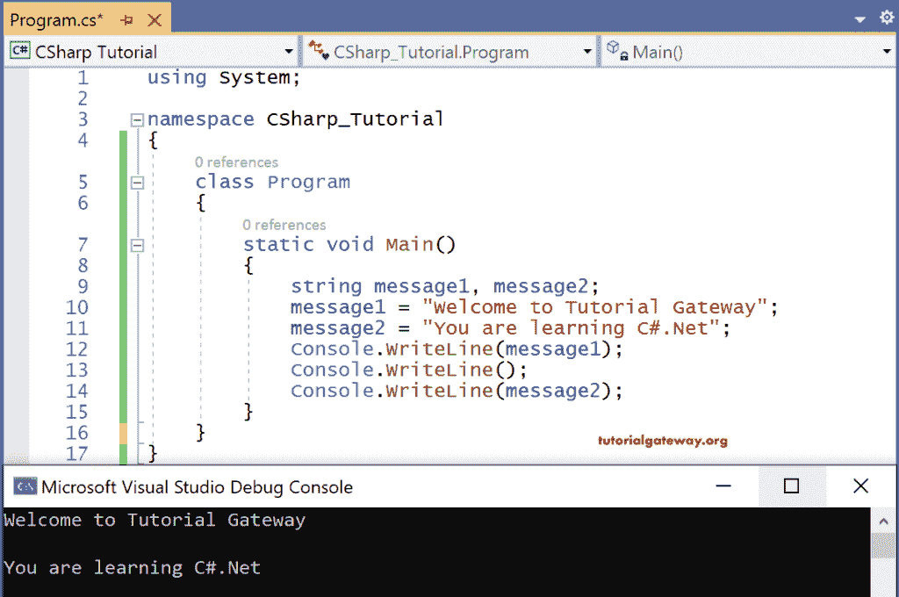

# C#变量

> 原文：<https://www.tutorialgateway.org/csharp-variables/>

C#中的变量只不过是给定的数据值的名称。数据值可以是任何数据类型，如字符串、浮点、int 等。

C#变量的语法是

```
<data type> <variable-name> = <value>; 
(or)
<data type> <variableName1>, <variableName2>,etc;
```

C#变量可以同时声明和初始化，也可以声明一次后再初始化。只要可以访问，初始化为变量的数据值可以在整个程序中更改。但是在使用它们之前，它应该被初始化；否则，它在执行时会产生编译时错误。

让我们看一个例子 [C#](https://www.tutorialgateway.org/csharp-tutorial/) 代码使用类型字符串变量 message1，message2。

```
using System;

namespace CSharp_Tutorial
{
    class Program
    {
        static void Main()
        {
            string message1, message2;
            message1 = "Welcome to Tutorial Gateway";
            message2 = "You are learning C#.Net";
            Console.WriteLine(message1);
            Console.WriteLine();
            Console.WriteLine(message2);
        }
    }
}
```

输出



消息 1 和消息 2 是两个变量。其中消息 1 用字符串“欢迎使用教程网关”初始化。

消息 2 用字符串“您正在学习 C#”初始化。净”。

使用控制台将这两个字符串打印到控制台上。Writeline()。其中 console 是类，Writeline()是 Console 类中的一个方法，它在控制台上打印值。