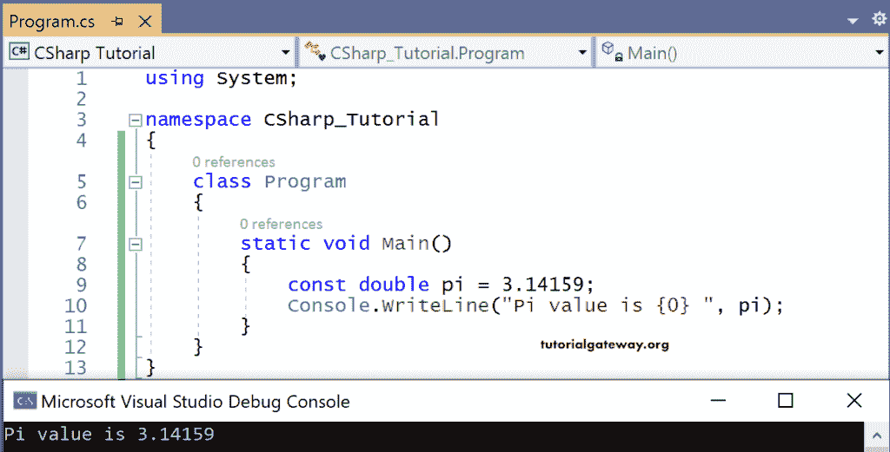

# C#常量

> 原文:[https://www.tutorialgateway.org/csharp-constant/](https://www.tutorialgateway.org/csharp-constant/)

变量可以通过使用 C#关键字 const 声明为常量。声明为常量的变量应该在声明时被赋值。

分配给常量变量的这个值是不可变的(不能在程序的整个执行生命周期中更改)，称为“编译时”。

const 关键字应用于任何内置值类型、枚举、字符串文字或引用类型。让我们看一个使用常量变量的 C#代码的例子。

```
using System;

namespace CSharp_Tutorial
{
    class Program
    {
        static void Main()
        {
            const double pi = 3.14159;
            Console.WriteLine("Pi value is {0} ", pi);
        }
    }
}
```

输出



在这个 [C#](https://www.tutorialgateway.org/csharp-tutorial/) 的例子中，pi 是一个双变量，其值为 3.14159。

因此 pi 被声明为常量变量。这个数字在程序的整个执行生命周期中保持不变。