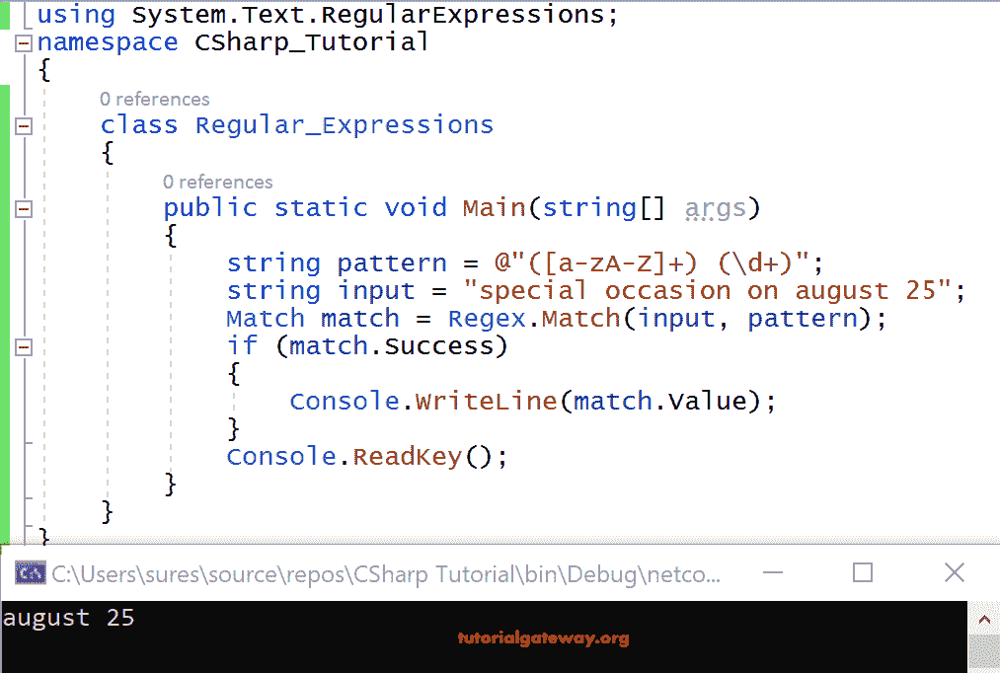
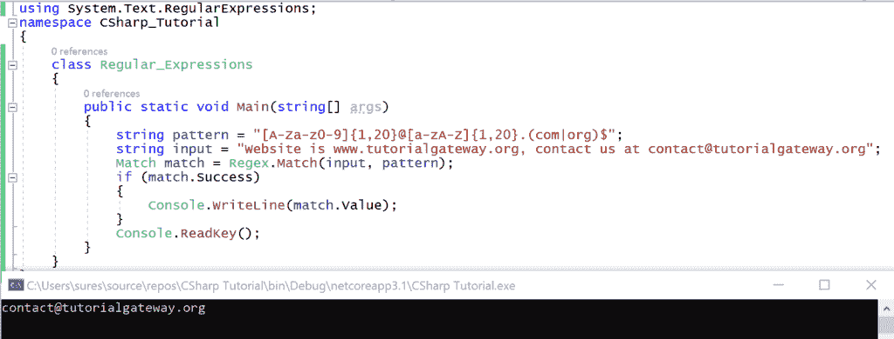

# C# 正则表达式

> 原文：<https://www.tutorialgateway.org/c-regular-expressions/>

C# 中的正则表达式有助于描述文本中的复杂模式。简而言之，这些 C# 正则表达式通常被称为正则表达式。我们首先需要理解的是在 Regex 表达式中，一切本质上都是一个字符。

所描述的 C# 正则表达式模式可以用于搜索、提取、替换和修改文本数据。C# 通过在 System 中提供类来支持正则表达式。正则表达式命名空间。

C# 中的正则表达式只不过是模式。定义模式后，我们可以通过搜索、提取、替换、修改来进行验证。

一般来说，每个结构化数据都有一些特定的模式。比如说

www.tutorialgateway.org

任何网址都有一些特定的模式，比如它以 www 开头，以 org 结尾，中间用点连接。

[【邮件保护】](/cdn-cgi/l/email-protection)

同样，电子邮件 id 也有特定的模式，如

它以一些字母数字字符开始，然后后面会有“@”符号。同样，可能有字母数字字符后跟一个点，再后跟“com”或“org”等。

2018 年 7 月 12 日(年月日)

日期格式有一定的模式，如 mm-dd-yy 格式或 mm-DD-yyy 格式。 [C# ](https://www.tutorialgateway.org/csharp-tutorial/) 正则表达式帮助我们定义这样的模式。

正则表达式如下所示。用于简单电子邮件验证的 C# Regex 是。

^[a-za-z0-9]{1,10}@[a-za-z0-9]{1,10}.(com|org|in)$

让我们看看写正则表达式的基本信息。

b 代表括号，C 代表胡萝卜，D 代表美元

| B | 正则表达式“[”和大括号“{”中使用了三种类型的括号。方括号指定必须匹配的字符，而花括号指定字符的数量。“(”用于分组 |
| C | 胡萝卜“^”是正则表达式的开始 |
| D | 美元" $ "正则表达式的结尾 |

## C# Regex 示例

以下示例显示了一些简单的 C# 正则表达式模式。

输入 a-g 之间的字符？

[a-g]–

输入长度为 3 的 a-g 之间的字符？

regex:^[a-g]{3}$–

输入最多三个字符和最少一个字符之间的字符？

^[a-g]{1,3}$

用 7 位固定数字格式验证数据，如 8743524、6864351 等。

^[0-9]{7}$

如何验证最小长度为三、最大长度为六的数值数据？

^[0-9]{3,7}$

如何验证像 KTG5240 这样格式的发票号码，前三位是字母字符，剩下的是 6 位数字的长度。

^[a-z]{3)[0-9]{6}$

让我们看看验证网址的简单 Regex。

^www.[A-Za-z0-9]{1，10}。(com|org|in)$

在 C# 中编写正则表达式时，总是建议使用逐字文本而不是正则字符串。

逐字文字以特殊前缀(@)开头，这有助于不解释字符串中的反斜杠和元字符。

例如，我们可以将它写成@" \n\m "，而不是写\\m\\n，这样字符串就可读了。

### C# 正则表达式字符串匹配

C# Regex 是命名空间系统中的一个类。正则表达式封装了正则表达式引擎的接口，因此允许我们使用正则表达式执行匹配并从文本中提取数据。

在 C# 中，有一个静态方法 Regex。匹配以测试 Regex 是否匹配字符串。枚举正则表达式是方法正则表达式的可选设置。Match 返回一个 Match 对象，该对象保存匹配信息(如果匹配的话)。

C# Regex 字符串匹配语法是

Match match = Regex。匹配(输入、模式、正则表达式)

让我们看一个例子来演示 C# 正则表达式。在这个 [C# ](https://www.tutorialgateway.org/csharp-tutorial/) 正则表达式的例子中，我们演示了“8 月 25 日”的正则表达式模式

```cs
using System;
using System.Text.RegularExpressions;

class program
{
    public static void Main(string[] args)
    {
        string pattern = @"([a-zA-Z]+) (\d+)";
        string input = "special occasion on august 25";
        Match match = Regex.Match(input, pattern);
        if(match.Success)
        {
            Console.WriteLine(match.Value);
        }
        Console.ReadKey();
    }
}
```

输出



分析

我们采用了一个字符串变量模式来存储正则表达式模式。接下来，输入是另一个字符串变量，用于存储我们想要在其中搜索模式匹配的文本。而 match 是一个 Match 类型的变量，用来存储静态方法正则表达式的结果。匹配返回。如果匹配成功，匹配值将打印到控制台上。

### C# RegEx 模式

下表显示了常见的 C# 正则表达式模式列表及其描述。

| abc… | 信 |
| 123… | 数字 |
| \d | 任何数字 |
| \D | 任何非数字字符 |
| 。 | 任何字符 |
| \. | 时期 |
| [abc] | 只有 a、b 或 c |
| [^abc] | 不是 a，b，也不是 c |
| [a-z] | 字符 a 到 z |
| [0-9] | 数字 0 到 9 |
| \w | 任何字母数字字符 |
| \W | 任何非字母数字字符 |
| {m} | m 次重复 |
| {m，n} | m 到 n 次重复 |
| * | 零次或多次重复 |
| + | 一次或多次重复 |
| ？ | 可选字符 |
| \s | 任何空白 |
| \S | 任何非空白字符 |
| ^…$ | 开始和结束 |
| (…) | 捕获组 |
| (公元前) | 捕获子组 |
| (.*) | 捕获全部 |
| (abc&# 124;def) | 匹配 abc 或 def |

让我们看看另一个演示 C# Regex 模式的代码，用于验证简单的电子邮件 id [【电子邮件保护】](/cdn-cgi/l/email-protection)

```cs
using System;
using System.Text.RegularExpressions;

class program
{
    public static void Main(string[] args)
    {
        string pattern = "[A-Za-z0-9]{1,20}@[a-zA-Z]{1,20}.(com|org)$";
        string input = "Website is www.tutorialgateway.org, contact us at [email protected]";
        Match match = Regex.Match(input, pattern);
        if(match.Success)
        {
            Console.WriteLine(match.Value);
        }
        Console.ReadKey();
    }
}
```

输出



分析

正如您在上面的示例代码中看到的，字符串变量模式是存储正则表达式模式。变量输入是存储我们给出的文本。

模式和输入都作为参数传递给 Regex。匹配方法，如果匹配成功，则返回匹配值。