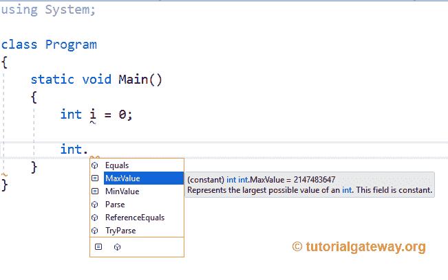
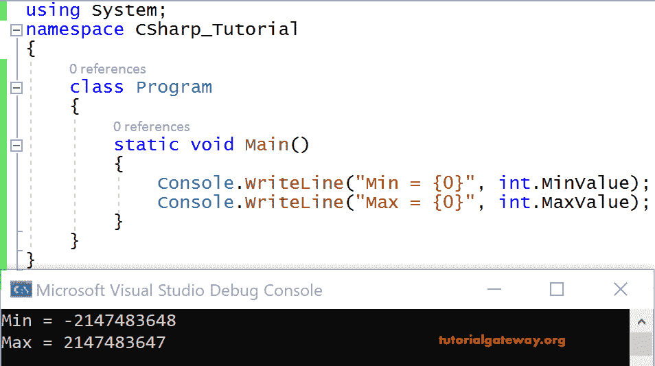

# C#内置数据类型

> 原文:[https://www.tutorialgateway.org/csharp-built-in-data-types/](https://www.tutorialgateway.org/csharp-built-in-data-types/)

本节向您展示了 C#编程语言中所有可用的内置数据类型的列表。C#程序由许多变量组成。变量只不过是给内存位置起的一个名字。

在一个内存位置，我们不断地改变值，所以我们想要存储在那个位置的数据类型只是一种数据类型。根据 C#数据类型、分配给变量的内存大小以及内存的格式来决定。

在许多情况下，大小可能相同，格式可能不同。例如:在 C#语言中，Long 和 Float 内置类型的大小为 4。然而，存储在存储单元中的数据的格式是不同的。

## C#内置数据类型

以下是 C#编程语言中内置数据类型的可用列表。

C#布尔数据类型:布尔数据类型用于我们想要存储值 true 或 false 的情况。

它只接受真或假。例如，

```
static void Main()
{
   bool b = true;
}
```

如果我们想问一个用户，“你住在美国吗？”那么答案应该是真或假。在这种情况下，我们使用 C#布尔数据类型。

C#整型:没有小数部分的数据类型称为整型。

有几种完整的数据类型，如字节、字节、短、短、整数、整数、长、整数、字符。所有这些完整的数据类型都能够保存一些数字。

| 类型 | 范围 | 大小 |
| sbyte(字节) | -128 到 127 | 有符号 8 位整数 |
| 字节 | 0 到 255 | 无符号 8 位整数 |
| 茶 | U+0000 至 U+ffff | Unicode 16 位字符 |
| 短的 | -32768 至 32767 | 有符号 16 位整数 |
| 乌肖特 | 0 至 65，535 | 无符号 16 位整数 |
| （同 Internationalorganizations）国际组织 | -2，147，483，648 至 2，147，483，647 | 有符号 32 位整数 |
| 无符号整型 | 0 至 4，294，967，295 | 无符号 32 位整数 |
| 长的 | -9，223，372，036，854，775，808 至 9，223，372，036，854，775，807 | 有符号 64 位整数 |
| 乌龙！乌龙 | 0 至 18，446，744，073，709，551，615 | 无符号 64 位整数 |

字节:字节数据类型的变量可以保存 0 到 255 之间的数字(256 个值)，即 8 位整数。

C#内置字节数据类型包含 8 位，每一位代表 0 或 1。现在 8 位一起代表 28 个不同的值。例如，如果我们想存储“人的年龄”的值，键入 byte 就足够了。

sbyte:这里，s 代表有符号，即负值和正值。如上表所示，它可以保存从-128 到 127 的数字，这意味着 28 (256)个值。

Int:整数类型的变量可以包含正值和负值。我们已经在表中给出了它的范围。它可以保存 32 位整数。

例如，如果我们存储任何国家的人口，我们可能会选择 int，因为它可以有一个很大的数字。

人口可以是一个确定的正数，这样我们就可以选择 uint，或者如果它在一个很大的范围内，我们可以选择 long 或 ulong。

根据应用的要求，我们可以选择不同的类型。但实际上，不可能记住每种数据类型可以容纳的最小值和最大值。

如果你可以访问 MSDN，那没问题，但如果不行，你甚至可以从 visual studio 了解。

我们在这里显示了 int 类型的所有属性。



让我给你看一个例子[内置数据类型的 C#](https://www.tutorialgateway.org/csharp-tutorial/) 代码。

```
using System;

class Program
{
    static void Main()
    {
        Console.WriteLine("Min = {0}", int.MinValue);
        Console.WriteLine("Max = {0}", int.MaxValue);
    }
}
```

输出



C#浮点类型

Float 和 Double 是 C#中内置的两种浮点数据类型。

为了存储精度(小数点后的数字)值，我们选择浮点或双精度类型。

| 类型 | 大致范围 | 精确 |
| 浮动 | 1.5e-45 至 3.4e38 | 7 位数 |
| 两倍 | 5.0e-324 至 1.7e308 | 15-16 位数字 |

数据类型浮点可以存储 32 位浮点值，而双精度浮点可以存储 64 位浮点值。

#### C#定点类型

十进制是一种定点类型，具有 28 位的固定精度。它表示 128 位数据类型。为了找到任何金融计算，或任何科学测量，我们选择了十进制类型十进制。因为十进制类型会给出结果，非常接近它的实际值。

例如，10/3 不是 3。实际值大约是 3.333。