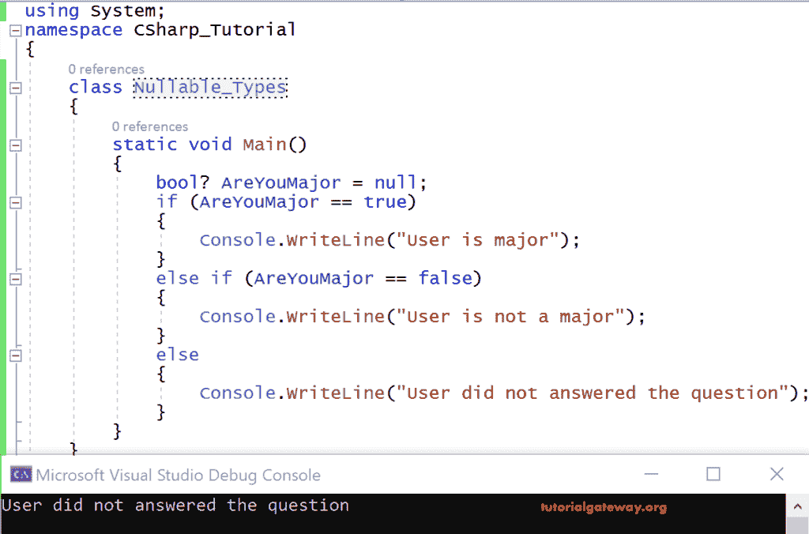

# C# 可空类型

> 原文：<https://www.tutorialgateway.org/csharp-nullable-types/>

默认情况下，所有 C# 值类型都是不可空的，引用类型称为 C# 可空类型。值类型的默认值是某种形式的 0。我们已经在上一篇文章中讨论了数据类型类别，即值类型和引用类型。

例如，任何 C# 整数类型变量的默认值都是 0，它们不能包含空值。

```cs
using System;

class Class1
{
  string str = null; // Valid statement
  int i = null;  //Not Valid
}
```

int i= null 无效，因为整数是值类型之一，所有值类型都不可为 null。

注意:值类型可以使用？

C# 可空类型的语法

```cs
int? i = null; // valid statement
```

C# 引入了可空类型的概念来解决数据库中的问题，同时存储一些特定的数据。例如，

bool AreYouMajor = null//无效语句

Bool 是一种[数据类型](https://www.tutorialgateway.org/csharp-built-in-data-types/)，可以接受真或假。但是在这种情况下，如果用户没有回答这个问题，空值应该存储在数据库中

你是少校吗:

在这种情况下，对于数据库中应该存储什么数据将会有混淆。如果我们存储 false，即“否”，我们无法区分他们是使用已回答的“否”还是未回答。为了避免这种混乱， [C# ](https://www.tutorialgateway.org/csharp-tutorial/) 布尔变量“AreYouMajor”可以为空。

即 bool？AreYouMajor = null//有效语句

```cs
using System;
class Class
{
  static void Main()
  {
    bool? AreYouMajor = null;
    if (AreYouMajor == true)
    {
      Console.WriteLine("User is major");
    }
    else if (AreYouMajor == false)
    {
      Console.WriteLine("User is not a major");
    }
    else
    {
      Console.WriteLine("User did not answered the question");
    }
  }
 }
```

输出

