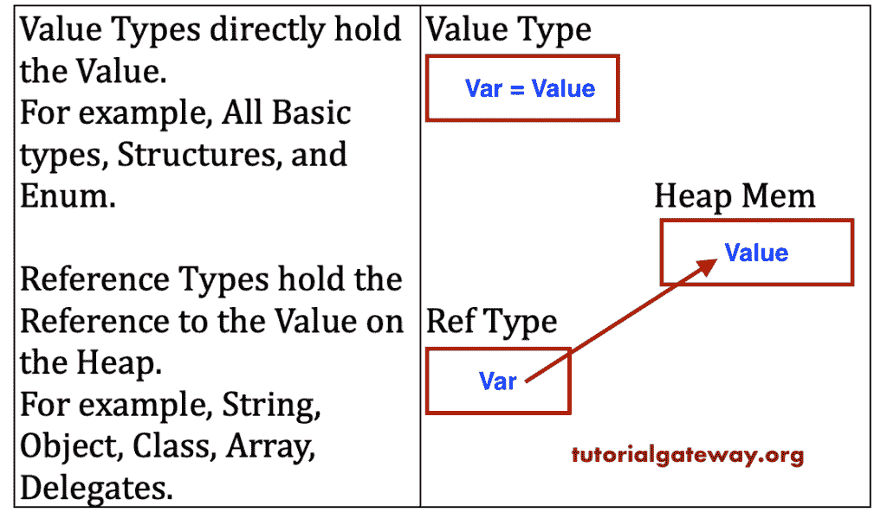

# C# 值类型和引用类型

> 原文：<https://www.tutorialgateway.org/csharp-value-types-and-reference-types/>

C# 值类型直接保存值，例如，所有基本类型、结构和枚举。但是，C# 引用类型包含对堆中值的引用，例如，字符串、对象、类、数组、委托。

## C# 值类型和引用类型

分配给变量的内存类型:

在进入数据类型类别(C# 值类型和引用类型)之前，让我们快速了解一下应用程序中的内存分类。

1.  全局:实际上，这是一个 C 语言的概念，其中全局变量将利用这个全局内存。这些变量在应用程序启动时分配内存。它们将一直保留到应用程序的生命周期。
2.  堆栈:由方法的局部变量使用。当一个方法调用时，一堆内存分配给那个特定的局部变量。当方法返回时，堆栈将被清除。
3.  堆:应用程序运行时的内存需求通过堆内存来满足。当一些内存分配给堆变量时，一旦它的作业完成，它必须返回到堆(解除分配)，以便被另一个变量重用。

### C# 值类型

一般来说，所有的基本数据类型、结构、枚举都属于值类型。

从某种意义上说， [C# ](https://www.tutorialgateway.org/csharp-tutorial/) 值类型是分配给包含变量实际值的变量的内存。

根据变量的范围，内存分配给值类型。如果是局部变量或参数，则分配堆栈内存。如果它是一个对象的成员，则在堆上分配内存。

### C# 引用类型

分配给 C# 引用类型的内存永远不会保存变量的实际值。相反，它保存对堆上值的引用。

在实时环境中，所有与内存相关的任务都由网络通过内存管理来管理。

但是作为一个程序员，最好知道这一点，这样你就可以更有效地优化你的代码，获得更好的性能。