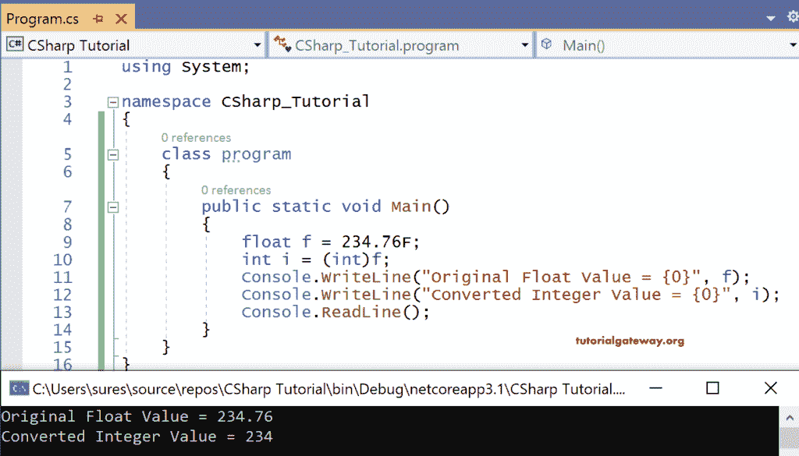
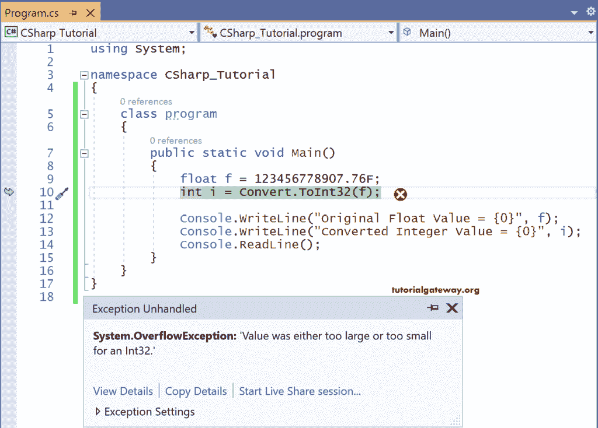
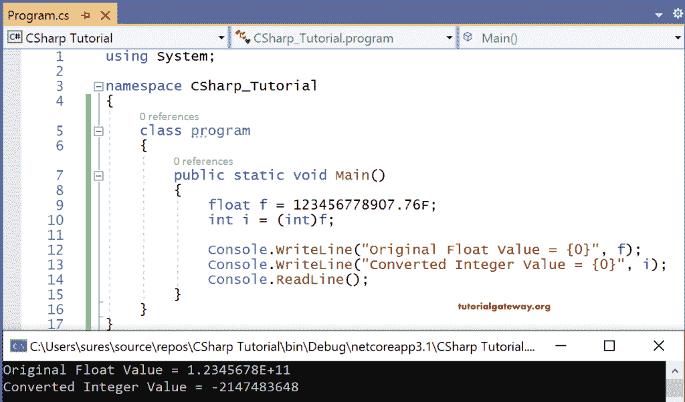
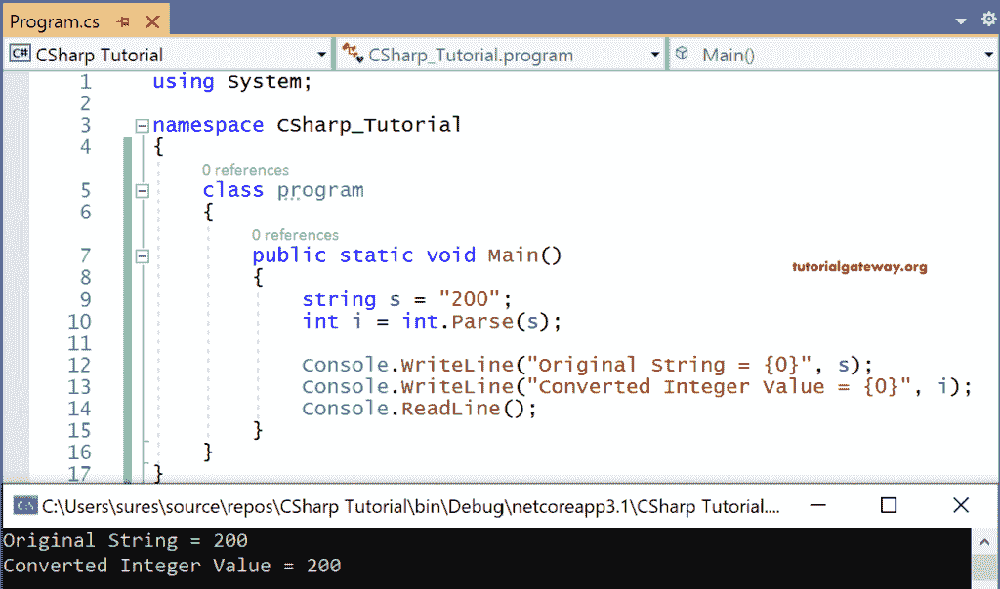
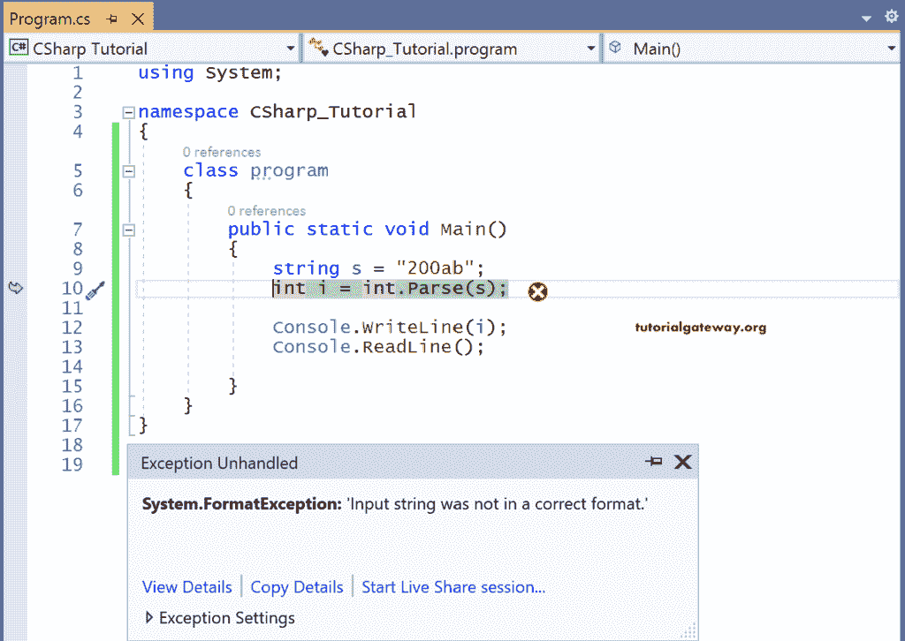
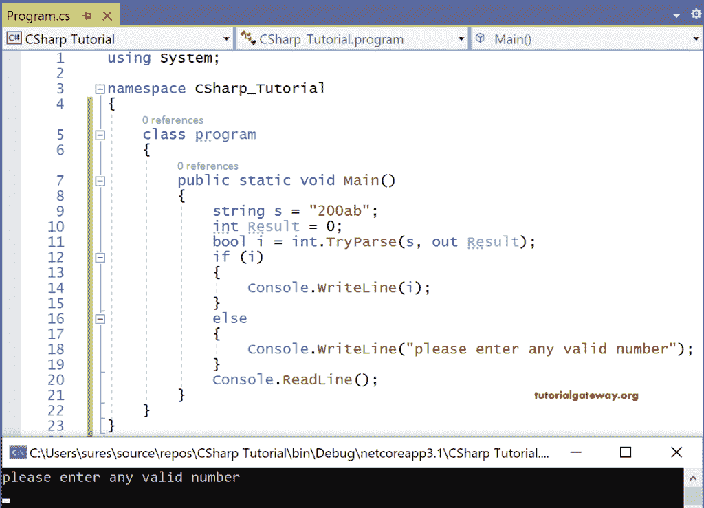

# C#数据类型转换

> 原文：<https://www.tutorialgateway.org/csharp-datatype-conversion/>

C#数据类型转换是一个概念，当我们想要将一个数据类型变量的值存储到另一个数据类型的变量中时，这个概念很有帮助。

C#是一种静态类型的语言。这意味着用一种数据类型声明的 C#变量不能再次声明，以存储另一种数据类型的值，除非将该类型转换为变量的类型。

当变量 I 声明为整数类型时

int I；

我们不能在 I 中存储字符串值

i = " hai

C#编译器将抛出一个错误，指出“无法将类型‘string’隐式转换为‘int’。

然而，我们有时可能会遇到这样的情况，我们需要将一个类型的值复制到一个数据类型不同的方法的变量或参数中。

也就是说，我们可能有一个整型变量，我们需要将它的值传递给一个参数为 float 或 double 类型的方法。

## C#数据类型转换示例

在 C#中，对数据类型的这种操作通常称为类型转换。

在 C#中，两种不同类型的转换实时发生。

1.  隐式转换
2.  显式转换

### C#隐式数据类型转换

从某种意义上说，这种转换是隐式的，是类型安全的，只有在下列情况下由 C#编译器自动完成。

1.  如果转换发生时没有信息丢失。
2.  如果在转换过程中没有抛出异常的机会。

让我们看一个 C#数据类型转换的例子来更好地理解它。

例如，将 int 转换为 float 不会丢失信息，也不会引发异常。

int i = 50

float f = I；

上面的语句是有效的，因为当执行时，它们不会因为浮点数比 int 大得多而丢失任何信息。

但是如果我们以相反的情况为例。

float f = 234.76

int I = f；

这些语句在执行时会出现编译时错误，表示“无法隐式将类型‘float’转换为‘int’”。

原因是在整数变量 I 中存储浮点值的过程中会丢失信息。因为整数不允许精度(十进制后的数字)，并且有可能抛出异常，因为浮点数的大小比 int 的大得多。

在这种情况下，我们需要使用类型转换运算符或 C#中的 Convert 类进行显式转换。

让我们首先看看在 C#中使用类型转换运算符。

```
using System;

namespace CSharp_Tutorial
{
    class program
    {
        public static void Main()
        {
            float f = 234.76F;
            int i = (int)f;
            Console.WriteLine("Original Float Value = {0}", f);
            Console.WriteLine("Converted Integer Value = {0}", i);
            Console.ReadLine();
        }
    }
}
```



浮点变量 f 持有双精度值 234.76。

当我们试图将其存储在整数变量 I 中时，我们需要使用类型转换运算符将浮点值转换为 int，该运算符为'(int)'。

由于整数不包含十进制值，它将只存储浮点值的整数部分。

即 234 是输出

### 使用转换类的 C#类型转换

Convert 是系统定义的用于数据类型转换的类。使用类型转换运算符和转换类的唯一区别将在下面的示例中解释。

```
using System;

namespace CSharp_Tutorial
{
    class program
    {
        public static void Main()
        {
            float f = 123456778907.76F;
            int i = Convert.ToInt32(f);

            Console.WriteLine("Original Float Value = {0}", f);
            Console.WriteLine("Converted Integer Value = {0}", i);
            Console.ReadLine();
        }
    }
}
```



这里我们试图存储一个比整数大得多的浮点值。

在这种情况下，如果我们使用 Convert 类进行类型转换，编译器将引发异常。

但是如果我们使用类型转换运算符，那么 [C#](https://www.tutorialgateway.org/csharp-tutorial/) 编译器将打印类型整数的最小范围。

```
using System;

namespace CSharp_Tutorial
{
    class program
    {
        public static void Main()
        {
            float f = 123456778907.76F;
            int i = (int)f;

            Console.WriteLine("Original Float Value = {0}", f);
            Console.WriteLine("Converted Integer Value = {0}", i);
            Console.ReadLine();
        }
    }
}
```

输出



这里我们试图存储一个比整数大得多的浮点值。

当类型转换运算符用于类型转换时，这种情况下编译器将打印类型整数的最小范围。

### C#字符串到数字(整型、浮点型、长型等)的转换。)

在我们想要将字符串值转换为整数格式的情况下，我们有两个选项

1.  解析()
2.  TryParse()

例如，使用 Parse() C#数据类型转换方法，我们可以将字符串格式的数字转换为整数格式，如下所示

```
using System;

namespace CSharp_Tutorial
{
    class program
    {
        public static void Main()
        {
            string s = "200";
            int i = int.Parse(s);

            Console.WriteLine("Original String = {0}", s);
            Console.WriteLine("Converted Integer Value = {0}", i);
            Console.ReadLine();
        }
    }
}
```



这里的“100”是一个数字，但采用字符串格式，即带有双引号。

解析方法对于将其转换为整数格式并最终在 I 变量中打印值非常有用。

### 如果数字是字符串格式–c#解析方法

如果数字是字符串格式，则使用 parse()会在无法解析值时引发异常。相比之下，TryParse()返回一个 bool，指示解析是成功还是失败。

如果我们确定解析实时有效，那么我们使用 parse()方法。否则，我们使用 TryParse()方法。

对于 C#数据类型转换示例

```
using System;

namespace CSharp_Tutorial
{
    class program
    {
        public static void Main()
        {
            string s = "200ab";
            int i = int.Parse(s);

            Console.WriteLine("Original String = {0}", s);
            Console.WriteLine("Converted Integer Value = {0}", i);
            Console.ReadLine();
        }
    }
}
```



此处 Parse()方法转换失败。因此它抛出了异常。

### 让我们看看使用 C#的 TryParse()方法

可以使用以下语法调用 TryParse()方法。

语法:

```
TryParse(<string variable> out <integer variable>)
```

TryParse()将始终返回 bool 值，如果解析成功则为真；否则，它返回 false。

让我们看看 C#的类数据类型转换示例代码。

```
using System;

namespace CSharp_Tutorial
{
    class program
    {
        public static void Main()
        {
            string s = "200ab";
            int Result = 0;
            bool i = int.TryParse(s, out Result);
            if (i)
            {
                Console.WriteLine(i);
            }
            else
            {
                Console.WriteLine("please enter any valid number");
            }
            Console.ReadLine();
        }
    }
}
```



这里的 s 是字符串变量，其值为“200ab”。

结果是整数变量，I 是存储 TryParse()结果的布尔变量。

由于 TryParse()返回一个 bool，我们已经编码，如果解析成功，则打印解析结果，否则打印语句

“请输入任何有效的数字”。