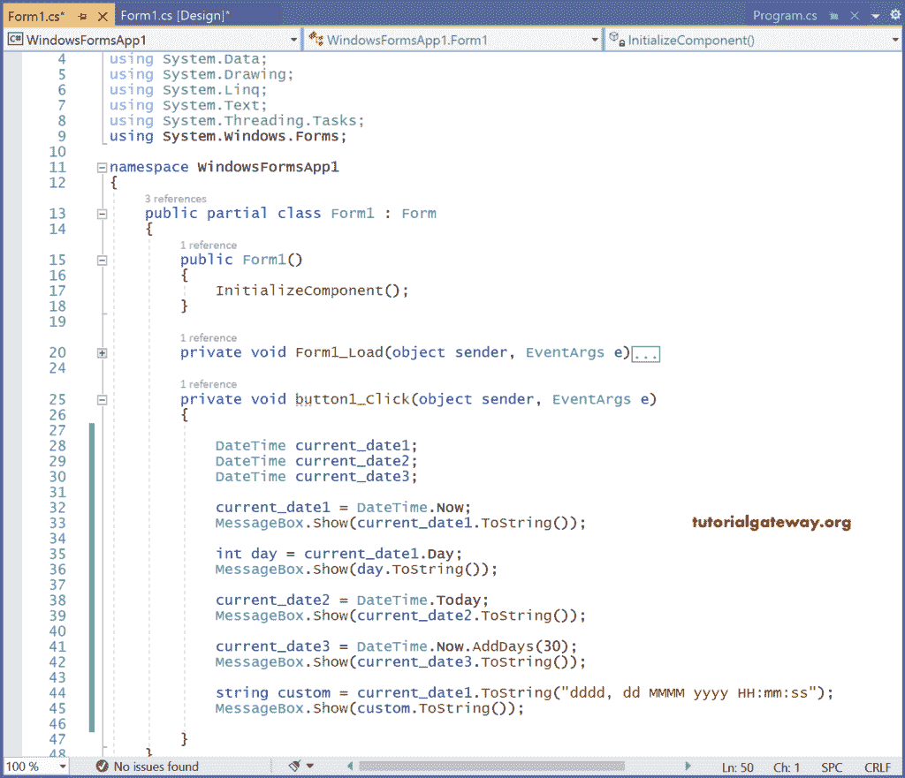
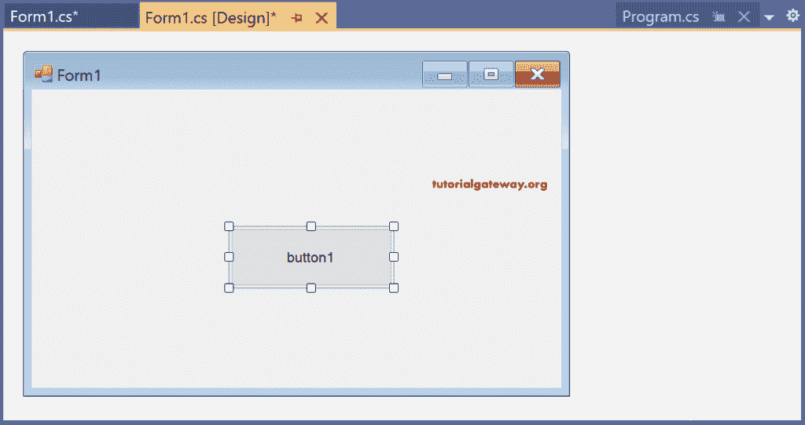
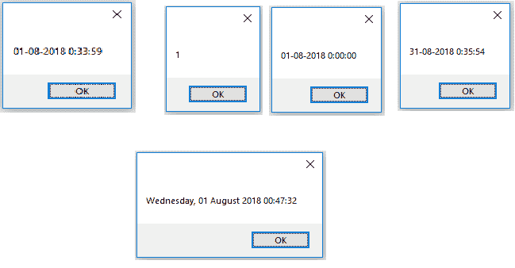

# C# 日期和时间格式

> 原文：<https://www.tutorialgateway.org/csharp-date-and-time-formatting/>

这个 C# 部分涵盖了 C# 编程语言中可用的日期和时间格式选项列表和一个实际例子。

C# 日期时间

C# 日期时间是可从 DotNet 框架中的系统命名空间获得的结构。因为 DateTime 是一个结构，而不是一个类，所以我们知道结构是值类型，也就是说，DateTime 可以创建为对象，但不能创建为引用。因为它是值类型，所以日期时间的变量或字段不能包含空值。

要存储空值，应该使用问号(？)将它们转换为可空类型)

ex:datetime？dt = null

DateTime 表示日期和时间，取值范围为 9999 年 12 月 31 日下午 00:00:00(0001 年 1 月 1 日)到 11:59:59

初始化 C# 日期时间对象

我们可以通过以下方式初始化 DateTime 对象:

调用构造器，可以是默认构造器，也可以是接受参数的构造器。

例如，日期时间的默认构造器如下所示

DateTime dt = new DateTime（）;

产出 1/1/0001 上午 12:00:00

以年、月、日、小时、分钟、秒重载的 DateTime 构造器如下所示:

DateTime dt = new DateTime（2018， 6， 12， 8， 20， 58）;

通过赋值

将属性或方法返回的日期和时间值分配给 DateTime 对象看起来像。

DateTime dt = DateTime.Now;

DateTime dt = DateTime。add days(20)；

将字符串解析为 C# 日期时间值

解析，锥函数通常用于将字符串解析为其等效的日期和时间值。

DateTime dt = DateTime。Parse("1985，01，14 ")；

用 C# 格式化日期和时间

通常，C# 日期和时间格式字符串使用格式说明符来定义其值的文本表示。

要定义日期和时间值的文本表示，如果使用单个格式说明符，则称其为标准日期和时间格式字符串。

如果日期和时间格式字符串包含多个字符(包括空格)，它将作为自定义格式字符串调用。

下表显示了不同的 C# 日期和时间格式说明符及其结果。

| C# 日期和时间格式说明符 | 结果 |
| D | 2018 年 7 月 30 日 |
| D | 30-07-2018 |
| F | 2018 年 7 月 30 日 23:38:50 |
| F | 2018 年 7 月 30 日晚上 11:38 |
| G | 30-07-2018 23:38:50 |
| G | 30-07-2018 晚上 11:38 |
| M | 7 月 30 日 |
| r | 2018 年 7 月 30 日星期一格林尼治时间 23:38:50 |
| s | 2018-07-30T23:38:50 |
| T | 23:38:50 |
| t | 晚上 11 点 38 分 |
| u | 2018-07-30 23:38:50Z |
| y | 2018 年 7 月 |
| 截止日期（Deadline Date 的缩写） | Thirty |
| ddd | 孟人 |
| 嗒嗒球拍 | 星期一 |
| 倍硬 | Eleven |
| 殿下 | Eleven |
| 毫米 | Thirty-eight |
| 梅智节拍器 | 07 |
| 嗯 | 七月 |
| 嗯 | 七月 |
| 悬浮物 | Fifty |
| 场流分级法 | One hundred and sixty-six |
| 场流分级法(field flow fractionation) | Four hundred and sixty-nine |
| 电汇 | 首相 |
| 尤尼克斯 | Eighteen |
| 是的 | 018 |
| 年份 | Two thousand and eighteen |

下表显示了不同的自定义 C# 数据和时间格式字符串及其结果。

| C# 日期和时间格式 | 结果 |
| 日期时间。现在. ToString("MM/dd/yyyy ") | 07/31/2018 |
| DateTime.Now.ToString(“dddd，dd MMMM 年”) | 2018 年 7 月 31 日星期二 |
| DateTime.Now.ToString(“dddd，dd MMMM 年 hh:mm”) | 2018 年 7 月 31 日星期二 08:15 |
| datetime 日期时间。Now.ToString("dddd、dd MMMM yyyy hh:mm tt ") | 2018 年 7 月 31 日星期二下午 08:15 |
| datetime 日期时间。Now.ToString("dddd、dd MMMM yyyy h:mm ") | 2018 年 7 月 31 日星期二 8:15 |
| datetime 日期时间。Now.ToString("dddd、dd MMMM yyyy h:mm tt ") | 2018 年 7 月 31 日星期二晚上 8:15 |
| DateTime.Now.ToString(“dddd，dd MMMM yyyy HH:mm:ss”) | 2018 年 7 月 31 日星期二 20:15:06 |
| 日期时间。现在. ToString("MM/dd/yyyy HH:mm ") | 07-31-2018 20:15 |
| datetime 日期时间。now . tostring(" mm/DD/yyyy hh:mm TT ") | 07-31-2018 08:15 下午 |
| 日期时间。现在. ToString("MM/dd/yyyy H:mm ") | 07-31-2018 20:15 |
| datetime 日期时间。Now.ToString("MM/dd/yyyy h:mm tt ") | 07-31-2018 晚上 8:15 |
| 日期时间。现在. ToString("MM/dd/yyyy HH:mm:ss ") | 07-31-2018 晚上 20:15:30 |
| 日期时间。现在.托斯特林(“MMMM dd”) | 7 月 31 日 |
| datetime 日期时间。now . tostring(" yyyy-mm-DD t hh:mm:ss . fffffffk ") | 2018-07-31T 00:34:54.0306280+05:30 |
| datetime 日期时间。Now.ToString("ddd，dd MMM yyy HH: mm: ss GMT ") | 图，2018 年 7 月 31 日格林尼治标准时间 34:54:03 |
| 日期时间。现在. ToString("yyyy-MM-dd T HH:mm:ss ") | 2018-07-31 T 20:15:30 |
| 日期时间。现在. ToString(“HH:mm”) | fifteen past eight p.m./a quarter past eight p.m. |
| 日期时间。现在.托斯特林(“hh:mm tt”) | 下午 08:15 |
| 日期时间。现在. ToString(“H:mm”) | fifteen past eight p.m./a quarter past eight p.m. |
| 日期时间。现在.托斯特林(“h:mm tt”) | 晚上 8 点 15 分 |
| 日期时间。现在. ToString(“HH:mm:ss”) | 20:15:06 |
| 日期时间。现在。到字符串(“yyy MMMM”) | 2018 年 7 月 |

## C# 日期和时间格式示例

让我们看一个 [C# ](https://www.tutorialgateway.org/csharp-tutorial/) 代码，用它的对象演示 DateTime 结构的不同属性和方法。

只需取一个 windows 窗体，向其中添加一个按钮，并在其按钮单击事件中编写以下代码。

```cs
using System;
using System.Collections.Generic;
using System.ComponentModel;
using System.Data;
using System.Drawing;
using System.Linq;
using System.Text;
using System.Threading.Tasks;
using System.Windows.Forms;

namespace WindowsFormsApp2
{
    public partial class Form1 : Form
    {
        public Form1()
        {
            InitializeComponent();
        }

        private void button1_Click(object sender, EventArgs e)
        {
            DateTime current_date1;
            DateTime current_date2;
            DateTime current_date3;

            current_date1 = DateTime.Now;
            MessageBox.Show(current_date1.ToString());

            int day = current_date1.Day;
            MessageBox.Show(day.ToString());

            current_date2 = DateTime.Today;
            MessageBox.Show(current_date2.ToString());

            current_date3 = DateTime.Now.AddDays(30);
            MessageBox.Show(current_date3.ToString());

            string custom = current_date1.ToString("dddd, dd MMMM yyyy HH:mm:ss");
            MessageBox.Show(custom.ToString());

        }
    }
}
```

输出



一旦你运行了这个 C# 日期和时间格式的项目，下面的窗口将会打开



当您单击按钮 1 时，消息框将显示日期。



current_date1、current_date2、current_date3 是为 DateTime 创建的不同对象。

对象 current_date1 用于通过 DateTime 属性显示当前系统日期。

日期时间。现在；

当前系统日期通过消息框显示。

同样的日期时间。AddDays(30)将通过在当前日期上添加 30 天来显示日期和时间。

最后，我们尝试显示自定义格式字符串 ddd 的结果，dd MMMM yyyy HH:mm:ss。