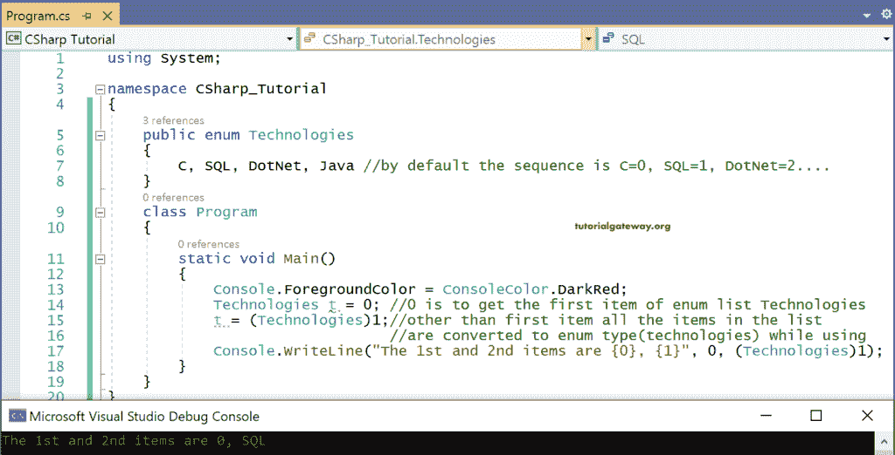
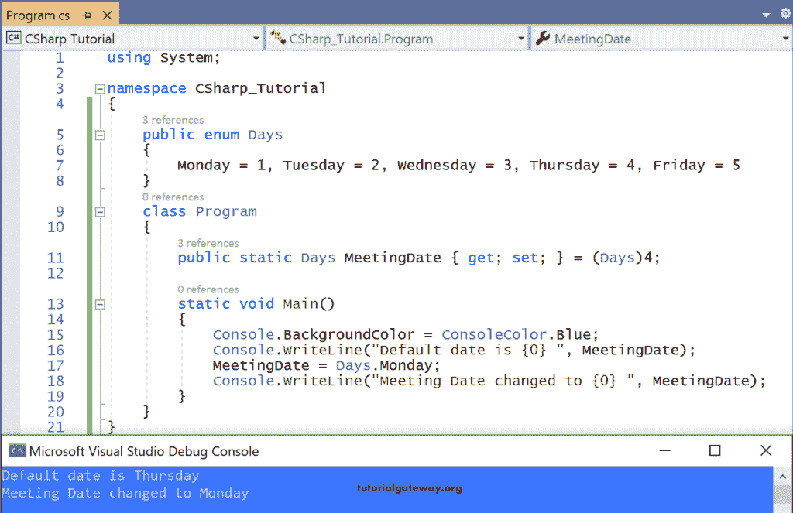

# C#枚举或枚举器

> 原文：<https://www.tutorialgateway.org/csharp-enum-or-enumerator/>

C#枚举是一种用户定义的数据类型，它包含一个名为枚举器列表的命名常量值列表。C#枚举或枚举器是值类型。建议在命名空间下直接定义一个枚举。它也可以嵌套在类或结构中。C#枚举器的语法是

```
[<Access Modifiers>] enum <Name> [: <type>]
{
      --list of named constant values--
}
```

例如

```
public enum Technologies
{
   C, SQL, Dot Net, Java
}
```

这里，[访问修饰符](https://www.tutorialgateway.org/csharp-access-modifiers/)是公共的，枚举是用名称 Technologies 创建的。

类型可以是任何整数类型(int、short、long、uint、ulong、byte、ushort、sbyte)，但默认值是 int。

让我们处理上面创建的 C#枚举。

```
using System;

namespace CSharp_Tutorial
{
    public enum Technologies
    {
        C, SQL, DotNet, Java //by default the sequence is C=0, SQL=1, DotNet=2....
    }
    class Program
    {
        static void Main()
        {
            Console.ForegroundColor = ConsoleColor.DarkRed;
            Technologies t = 0; //0 is to get the first item of enum list Technologies
            t = (Technologies)1;//other than first item all the items in the list 
                                //are converted to enum type(technologies) while using
            Console.WriteLine("The 1st and 2nd items are {0}, {1}", 0, (Technologies)1);
        }
    }
}

```

输出



正如我们已经讨论过的，枚举必须直接在命名空间下定义。和 Main()方法中的代码。

要打印 [C#](https://www.tutorialgateway.org/csharp-tutorial/) 枚举列表中的第一项，Technologies，我们可以直接使用 0。技术 t = 0

但是剩余的项应该通过转换为枚举类型 Technologies 来调用，即 t = (Technologies)1。

这里，t 是 Technologies 类型的变量。

最后，打印枚举列表中的第一项和第二项。

Foregroundcolor、Backgroundcolor 是系统命名空间中控制台类的属性。相比之下，Consolecolor 是不同颜色的枚举列表。

## C#枚举或枚举器示例

让我们实际看看 C#枚举器的用法。

```
using System;

namespace CSharp_Tutorial
{
    public enum Days
    {
        Monday = 1, Tuesday = 2, Wednesday = 3, Thursday = 4, Friday = 5
    }
    class Program
    {
        public static Days MeetingDate { get; set; } = (Days)4;

        static void Main()
        {
            Console.BackgroundColor = ConsoleColor.Blue;
            Console.WriteLine("Default date is {0} ", MeetingDate);
            MeetingDate = Days.Monday;
            Console.WriteLine("Meeting Date changed to {0} ", MeetingDate);
        }
    }
}
```

输出



控制台是系统定义的枚举，天数是用户定义的枚举。

枚举天数是指列表中的所有工作日，每个工作日都用用户定义的数字初始化。

在这里，我们刚刚创建了一个名为“日期”的属性，并为其分配了默认值 4，即默认日期是星期四。

在 C#枚举或枚举器示例的 Main()代码中，

当我们尝试更改会议日期时，它会提示我们选择枚举器列表天数值。不允许我们给出清单之外的价值。比如周六。

注意:因此枚举限制用户从支持的特定列表中选择项目，即用户不能选择枚举列表以外的值。