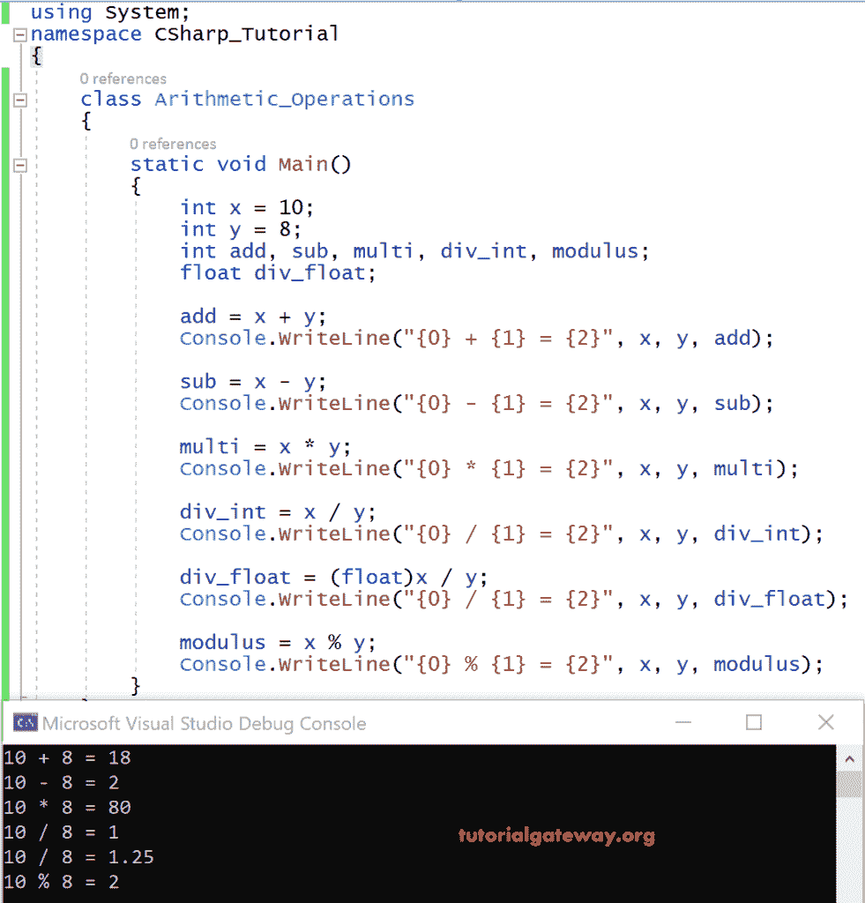

# C#算术运算符

> 原文：<https://www.tutorialgateway.org/csharp-arithmetic-operators/>

C#中的算术运算符用于执行数学计算，如加法、减法、乘法、除法、模数。基本上，这些 C#算术运算符处理两个操作数。因此这些被称为二元运算符。

下表显示了可用的 C#算术运算符列表，并解释了它们的操作。

| 算术运算符 | 操作 | 例子 |
| + | 添加 | 3 + 2 = 5 |
| – | 减法 | 3 – 2 = 1 |
| * | 增加 | 3 * 2 = 6 |
| / | 分开 | 3 / 2 = 1 |
| % | 系数 | 3 % 2 = 1 |

让我们看一个例子，这样我们就可以清楚地了解这些 C#算术运算符。

## C#算术运算符示例

在下面的 C#示例中，我们使用一个整数变量 x 和双变量 y 作为两个操作数，并对它们执行算术运算。

当我们应用除法/运算符时，我们必须记住以下几点。

1.  任何数除以零都会产生应用错误。Ex: x/0
2.  默认情况下，结果总是舍入到最接近的整数。例:11/2 等于 5。
3.  变量必须是相同的数据类型(int-int、double-double 等)。)除非它们可以隐式转换。在隐式转换中，系统允许以类型安全的方式进行转换，并且不会丢失任何数据。
4.  如果我们想要除法的精确值，例如:3/2 = 1.5，其中 3 和 2 是整数值，我们必须显式地将结果类型转换为 float 类型。

```
using System;

class Arithmetic_Operations
{
    static void Main()
    {
        int x = 10;
        int y = 8;
        int add, sub, multi, div_int, modulus;
        float div_float;

        add = x+y;
        Console.WriteLine("{0} + {1} = {2}", x, y, add);

        sub = x-y;
        Console.WriteLine("{0} - {1} = {2}", x, y, sub);

        multi = x*y;
        Console.WriteLine("{0} * {1} = {2}", x, y, multi);

        div_int = x/y;
        Console.WriteLine("{0} / {1} = {2}", x, y, div_int);

        div_float = (float)x/y;
        Console.WriteLine("{0} / {1} = {2}", x, y, div_float);

        modulus = x%y;
        Console.WriteLine("{0} % {1} = {2}", x, y, modulus);
    }
}
```

输出



分析

在上例中，整数变量 x 和 y 是我们应用算术运算符(+、-、*、/、%)的两个操作数。

精确到 10/8，我们已经显式转换为类型 float，并将 [C#](https://www.tutorialgateway.org/csharp-tutorial/) 结果存储为 float 变量 div_float。