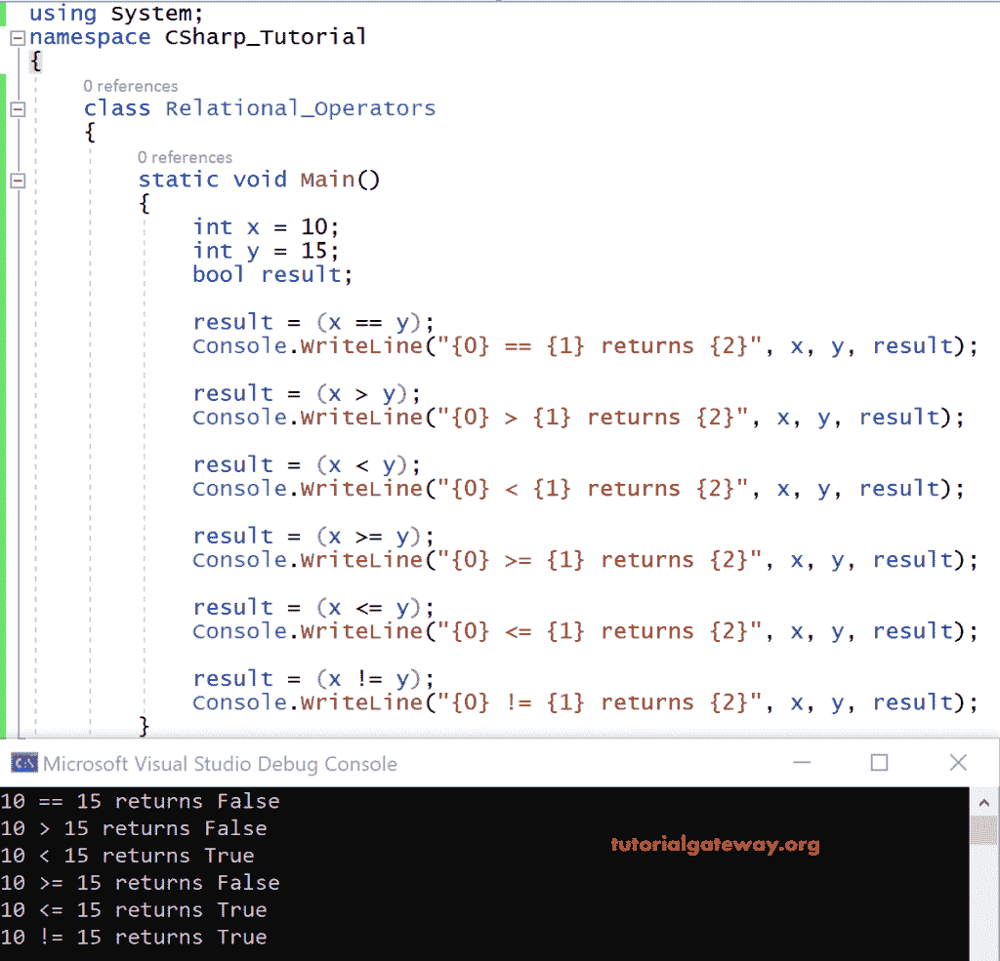

# C# 关系运算符

> 原文：<https://www.tutorialgateway.org/csharp-relational-operators/>

C# 关系运算符处理两个操作数，如果满足两个操作数之间的关系，则返回布尔值 true (1)。否则，它返回 false (0)。下面的 C# 关系运算符表显示了不同的关系运算符。

| 标志 | 操作 | 例子 |
| = = | 等于 | 3 = = 2 返回假 |
| > | 大于 | 3 > 2 返回真 |
| < | 不到 | 3 < 2 返回假 |
| > = | 大于或等于 | 3 > = 2 返回真 |
| < = | 小于或等于 | 3 < = 2 返回假 |
| ！= | 不等于 | 3 != 2 返回真 |

## C# 关系运算符示例

在下面的 C# 代码中，我们取了两个整数变量 x 和 y，在对它们应用不同的关系运算符后，结果存储在一个布尔变量结果中。

```
using System;

class Relational_Operators
{
     static void Main()
     {
         int x = 10;
         int y = 15;
         bool result;

         result= (x==y);
         Console.WriteLine("{0} == {1} returns {2}", x, y, result);

         result= (x>y);
         Console.WriteLine("{0} > {1} returns {2}", x, y, result);

         result= (x<y);
         Console.WriteLine("{0} < {1} returns {2}", x, y, result);

         result= (x>=y);
         Console.WriteLine("{0} >= {1} returns {2}", x, y, result);

         result= (x<=y)
         Console.WriteLine("{0} <= {1} returns {2}", x, y, result);

         result= (x != y);
         Console.WriteLine("{0} != {1} returns {2}", x, y, result);
     }
}
```

在上面的 [C# ](https://www.tutorialgateway.org/csharp-tutorial/) 例子中，整数变量 x=10，y=15 是两个操作数。并且在对它们应用关系运算符时，表达式的值是满足的，否则真存储在结果中，否则假。

