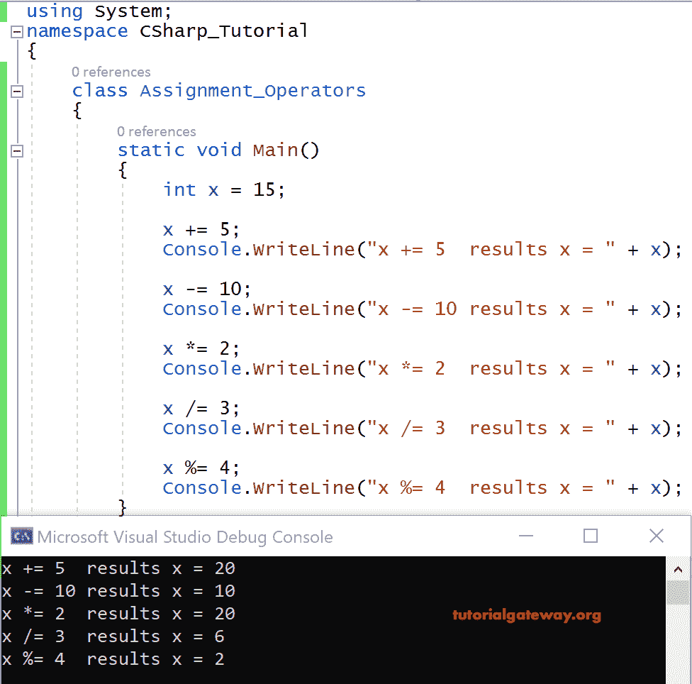

# C#赋值运算符

> 原文：<https://www.tutorialgateway.org/csharp-assignment-operators/>

C#赋值运算符作为前缀与算术运算符相关联，即+=，-=，*=，/=，%=。下表显示了 c#中可用的赋值运算符列表。

| 标志 | 操作 | 例子 |
| += | 加等于 | x+=15 等于 x=x+15 |
| -= | 减等于 | x- =15 是 x=x-15 |
| *= | 乘以等于 | x*=16 等于 x=x+16 |
| %= | 模数等于 | x%=15 是 x=x%15 |
| /= | 除以等于 | x/=16 等于 x=x/16 |

## C#赋值运算符示例

让我们看一个使用 C #赋值运算符的示例代码。

```
using System;

class Assignment_Operators
{
     static void Main()
     {
         int x = 15;

         x += 5;
         Console.WriteLine("x += 5 results x = " + x);

         x -= 10;
         Console.WriteLine("x -= 10 results x = " + x);

         x *= 2;
         Console.WriteLine("x *= 2 results x = " + x);

         x /= 3;
         Console.WriteLine("x /= 3 results x = " + x);

         x %= 4;
         Console.WriteLine("x %= 4 results x = " + x);
     }
}
```

输出



x 是一个整数，我们已经在上面的 [C#](https://www.tutorialgateway.org/csharp-tutorial/) 代码中应用了所有可用的。

x+=5

= x+5 = 20；

x-=10

= x-10 = 20-10 = 10

x*=2
= x*2 = 10 * 2 = 20

x/=3
= x/3 = 20 / 3 = 6

x%=4
= x%4 = 6 % 4 = 2