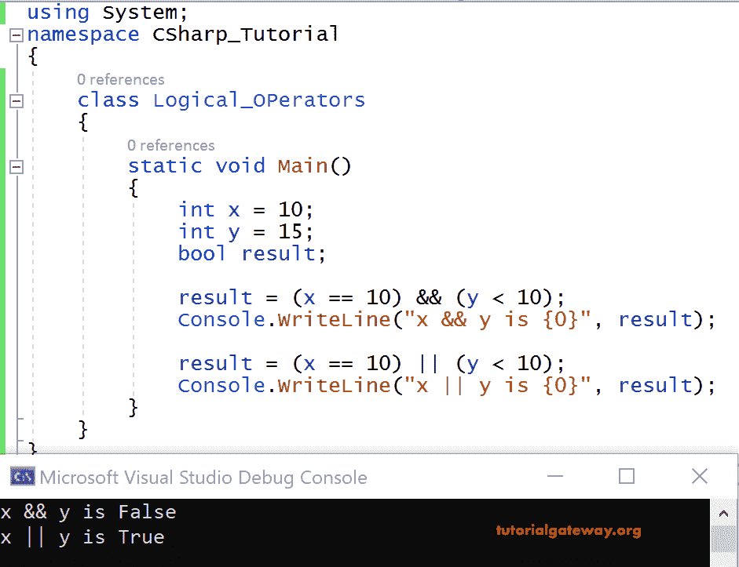

# C# 逻辑运算符

> 原文：<https://www.tutorialgateway.org/csharp-logical-operators/>

C# 逻辑运算符用于对操作数执行逻辑运算。使用这些 C# 逻辑运算符来分析多个条件。例如，要找出三个数字中最大的一个，我们使用 a > b && a > c。

逻辑运算符的条件通常包含在括号中。下表显示了 C# 中的逻辑运算符。

| 标志 | 操作 | 例子 |
| && | 和 | 3 != 2 && 4==4 返回真 |
| &# 124;&# 124; | 运筹学 | 4= =4 &# 124;&# 124; 6 = = 6 返回真 |

&如果第一个和第二个条件都为真，则运算符返回真。

||如果第一个或第二个条件为真，则返回 true。

这里是 [C# ](https://www.tutorialgateway.org/csharp-tutorial/) & &和||运算的真值表。

| 操作数 1 | 操作数 2 | &&操作 | &# 124;&# 124;操作 |
| 真实的 | 真实的 | 真实的 | 真实的 |
| 真实的 | 错误的 | 错误的 | 真实的 |
| 错误的 | 真实的 | 错误的 | 真实的 |
| 错误的 | 错误的 | 错误的 | 错误的 |

## C# 逻辑运算符示例

让我们看一个逻辑运算符的例子。x = 10 和 y = 15 是两个整数变量，结果是布尔变量。

```cs
using System;

 class Logical_OPerators
 {
     static void Main()
     {
         int x = 10;
         int y = 15;
         bool result;

         result = (x == 10) && (y < 10);
         Console.WriteLine("x && y is {0}", result);

         result = (x == 10) || (y < 10);
         Console.WriteLine("x || y is {0}", result);
     }
 }
```

输出



分析

我们已经将 x 指定为 10，即 x = 10，y 指定为 15，即 y = 15。

接下来，x ==10 返回真，y < 10 返回假。比较两个结果，即真和假，返回假。

现在转到||，x = = 10 返回真，y < 10 返回假。根据真值表，真||假返回真。