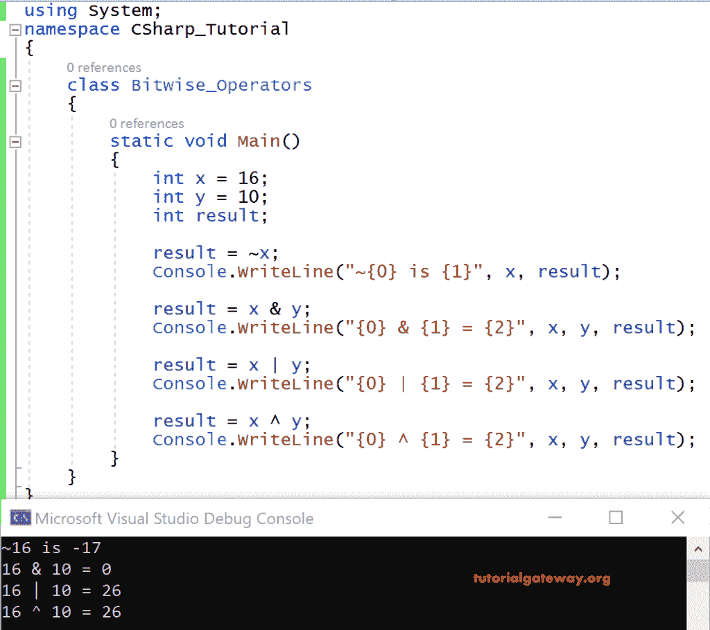
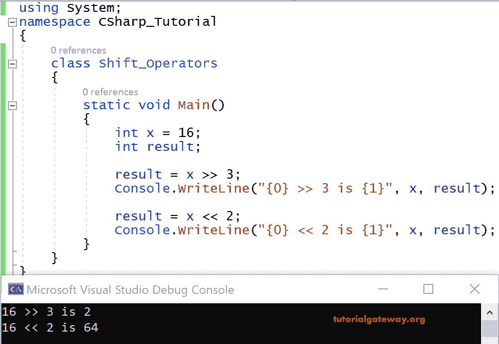

# C#按位运算符

> 原文：<https://www.tutorialgateway.org/csharp-bitwise-operators/>

C#按位运算符仅适用于数字。在这些运算符处理给定的输入(数字)之前，系统会将该数字从十进制转换为二进制。然后，C#按位运算符对位(二进制)执行操作。然后最后，将位转换为十进制后，结果以十进制的形式显示给我们。

输入(十进制)->(十进制到二进制)->按位运算符对位执行必要的操作-->位转换为十进制-->结果以十进制形式显示。

| 标志 | 操作 | 例子 |
| & | 按位“与” | 16 & 10 =0 |
| &#124; | 按位“或” | 16 &#124; 10 =26 |
| ~ | 逐位补码 | ~16= -17 |
| ^ | 异或 | 16 ^ 10=26 |

让我们看看这些 C#按位运算符的真值表。

| X | y | x & y | x &#124; y | x ^ y |
| Zero | Zero | Zero | Zero | Zero |
| Zero | one | Zero | one | one |
| one | Zero | Zero | one | one |
| one | one | one | one | Zero |

## C#按位运算符示例

以下示例向您展示了所有按位运算符的工作功能。

```
using System;

class Bitwise_Operators
{
   static void Main()
   {
     int x = 16;
     int y = 10;
     int result;

     result = ~x;
     Console.WriteLine("~{0} is {1}", x, result);

     result = x & y;
     Console.WriteLine("{0} & {1} = {2}", x, y, result);

     result = x | y;
     Console.WriteLine("{0} | {1} = {2}", x, y, result);

     result = x ^ y;
     Console.WriteLine("{0} ^ {1} = {2}", x, y, result);
   }
}
```

输出



分析

x = 16，y = 10

C#按位运算执行如下:

首先，16 和 10 被转换成比特。

16 的二进制形式是 10000，10 是 1010。

~(16)是-17，是 16 的二进制补码。

10000 & 01010 为 00000
结果为 0

10000 | 01010 是 11010
11010 的十进制形式是 26

10000 ^ 01010 是 11010
11010 的十进制形式是 26

### C#移位运算符

C#位移位运算符移动位位置。这意味着左操作数的位位置向左或向右移动，即右操作数中指定的位置数。 [C#](https://www.tutorialgateway.org/csharp-tutorial/) 通过右移(> >)和左移(< <)操作符启用位移。

| 移位运算符 | 操作 | 例子 |
| >> | 右移操作 | 16 >> 3 是 |
| << | 左移操作 | 16 << 2 |

让我们看一个使用这些按位移位运算符的 C#代码的例子。

#### C#按位左移和右移运算符示例

```
using System;

 class Shift_Operators
 {
     static void Main()
     {
         int x = 16;
         int result;

         result = x >> 3;
         Console.WriteLine("{0} >> 3 is {1}", x, result);

         result = x << 2;
         Console.WriteLine("{0} << 2 is {1}", x, result);
     }
 }
```

输出



分析

在上面的代码中

16 >> 3，16 的二进制形式是 0001 0000

10000 向右移动三位数，即 0000 0010，其十进制值为 2。

16 << 2，将 16 的二进制形式，即 0001 0000 向左移动 2 位数后，结果为 0100 0000，其十进制形式为 64。