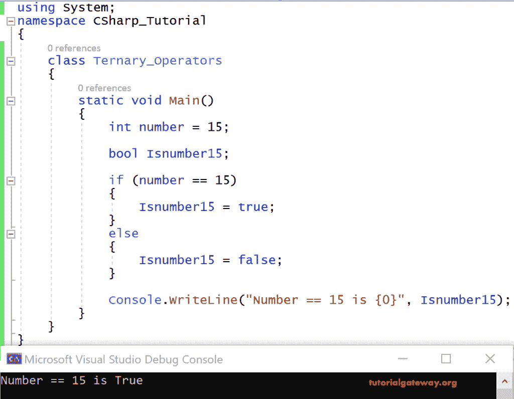
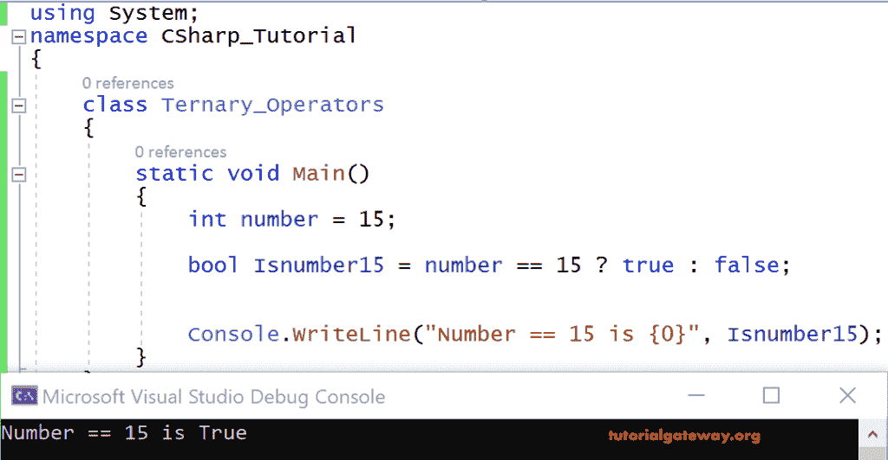

# C#三元运算符

> 原文:[https://www.tutorialgateway.org/csharp-ternary-operator/](https://www.tutorialgateway.org/csharp-ternary-operator/)

就像`if`语句一样，C#三元运算符测试一个条件，并用条件的结果初始化一个变量。

C#三元运算符语法

```
<condition> ? <expression1> : <otherwise expression 2>;
```

如果条件满足，三元运算符返回表达式 1；否则，它返回表达式 2。让我们看一个使用 C#条件运算符的例子。

使用`if-else`语句的示例 C#代码

```
using System;

 class Ternary_Operators
 {
   static void Main()
   {
     int number = 15;

     bool Isnumber15;

     if(number == 15)
     {
       Isnumber15 = true;
     }
     else
     {
       Isnumber15 = false;
     }

     Console.WriteLine("Number == 15 is {0}", Isnumber15);
   }
 }
```

输出



分析

这里，number 是一个用 15 初始化的整数变量。Isnumber15 是一个存储结果的布尔变量。

我正在使用 [if 条件](https://www.tutorialgateway.org/csharp-if-statement/)检查 number == 15。如果条件返回满足，则 Isnumber 返回真，否则 Isnumber 返回假。

这里，Isnumber = true 打印在 [C#](https://www.tutorialgateway.org/csharp-tutorial/) 控制台上。

## C#三元运算符示例

这与我们在上面指定的示例相同。但是，这次我们使用的是 C#三元运算符。三元函数返回语句的结果，它不会执行语句。

它返回任何数据类型的值。

使用条件运算符的 C#代码

```
using System;

 class Ternary_Operators
 {
   static void Main()
   {
     int number = 15;

     bool Isnumber15 = number == 15 ? true : false;

     Console.WriteLine("Number == 15 is {0}", Isnumber15);
   }
 }
```

输出



分析

使用三进制运算符将代码的大小缩小了太多。

在上面的代码中，我们将一条语句的结果收集到一个布尔变量 Isnumber 15 中。结果会打印出来。

我们甚至可以直接打印，即在上面的代码中，而不是收集到一个变量中

```
bool Isnumber15 = number == 15 ? true : false;

Console.WriteLine(“Number == 15 is”, Isnumber15); 
```

我们可以这样写，而不是用两行来写:

```
Console.WriteLine(number == 15 ? true : false);
```