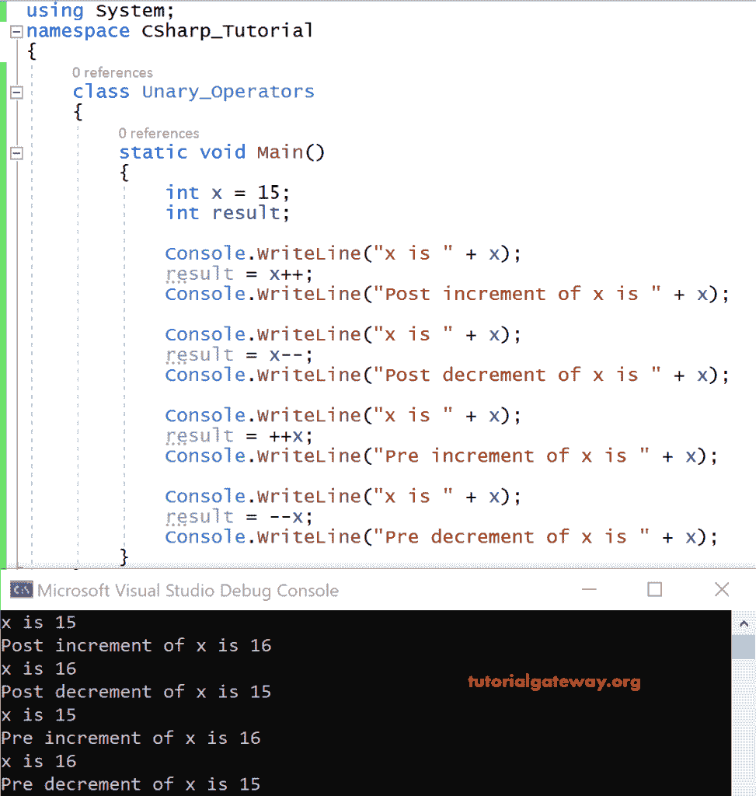

# C# 一元运算符

> 原文：<https://www.tutorialgateway.org/csharp-unary-operators/>

C# 一元运算符也称为递增和递减运算符。这些 C# 一元运算符一般用在循环概念中。

C# 增量运算符有两种类型:前增量(+i)和后增量(i++)。C# 减量运算符也有两种类型:后减量(I –)和前减量(–I)。

一般来说，在使用循环概念时，应该识别 C# 后增量(或后减量)和前增量(或前减量)的区别。当我们使用后递增和后递减时，首先，将执行整个循环。然后，该值相应地递增或递减。

在预递增和预递减的情况下，首先，该值将在循环执行之前递增或递减。

| 一元运算符 | 操作 | 例子 |
| ++ | 增量运算符 | 15++是 16，+++15 是 16 |
| — | 递减运算符 | 16–是 15，–16 是 15 |

## C# 一元运算符示例

以下示例有助于您理解 C# 递增和递减运算符的功能。

```
using System;

 class Unary_Operators
 {
     static void Main()
     {
         int x = 15;
         int result;

         Console.WriteLine("x is " + x);
         result = x++;
         Console.WriteLine("Post increment of x is " + x);

         Console.WriteLine("x is " + x);
         result = x--;
         Console.WriteLine("Post decrement of x is " + x);

         Console.WriteLine("x is " + x);
         result = ++x;
         Console.WriteLine("Pre increment of x is " + x);

         Console.WriteLine("x is " + x);
         result = --x;
         Console.WriteLine("Pre decrement of x is " + x);
     }
 }
```

输出



分析

x=15 -> x++ = 16，也就是说，x++会将其值 15 增加 1，结果是 16

x = 16-> x –= 15，即 x–将 I 的值 16 增加 1。而 [C# ](https://www.tutorialgateway.org/csharp-tutorial/) 结果为 15。