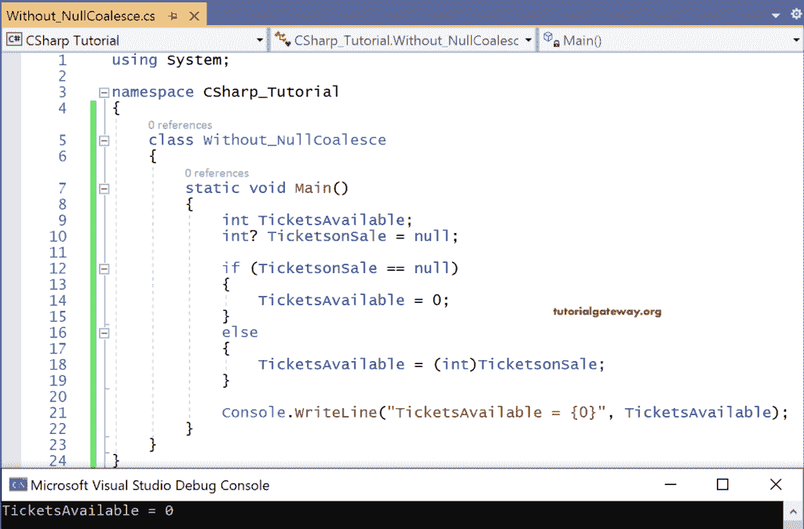
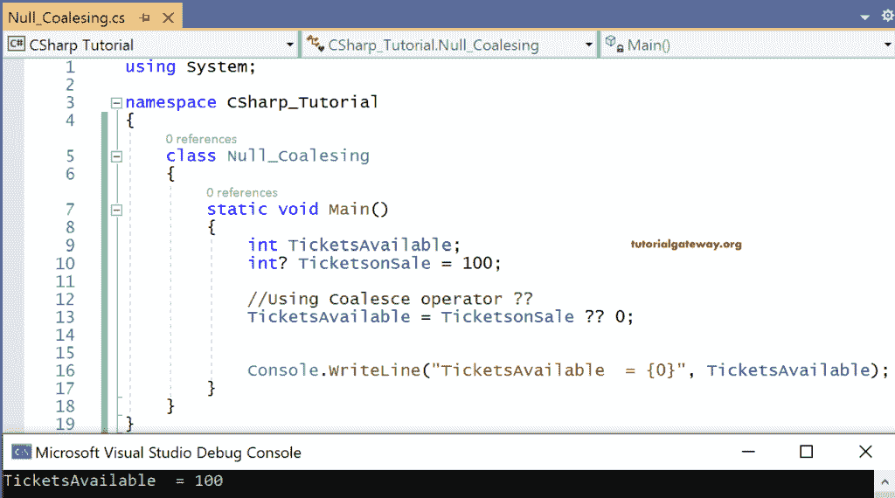

# C#空合并运算符

> 原文：<https://www.tutorialgateway.org/csharp-null-coalescing-operator/>

C#空合并运算符？？是一个二进制运算符，它可以用于可空类型和引用类型。

C#空合并运算符的语法如下:

```
a ?? b
```

如果 a 是非空值，则计算结果为 a，否则为 b

让我们看一个例子来理解空合并运算符的用法。

## C#空合并运算符示例

TicketsAvailable 是一个不可空的 int 变量，而 TicketsonSale 是一个可空的 int 变量，其值为 Null。在 if 条件下，我们正在检查 TicketsonSale 是否为空。

在这里，在这种情况下，我们将 TicketsonSale 指定为 null，所以很明显结果将是

TicketsAvailable = 0

不使用空合并的 C#代码

```
using System;

namespace CSharp_Tutorial
{
    class Without_NullCoalesce
    {
        static void Main()
        {
            int TicketsAvailable;
            int? TicketsonSale = null;

            if (TicketsonSale == null)
            {
                TicketsAvailable = 0;
            }
            else
            {
                TicketsAvailable = (int)TicketsonSale;
            }

            Console.WriteLine("TicketsAvailable = {0}", TicketsAvailable);
        }
    }
}
```

输出



现在让我们初始化，TicketsonSale = 100，这意味着将执行 else 部分。

我们将 TicketsonSale 类型转换为不可空整型变量的原因是，

TicketsonSale 是一个可空的 int 变量，我们尝试将可空的 int 变量的值存储到一个不可空的 int 变量中，即 TicketsAvailable。

它给出了一个错误。所以这是一个将可空 int 类型的结果转换为不可空 int 类型，然后存储在不可空 int 变量 TicketsAvailable 中的过程。

现在使用空合并运算符(？？)，我们可以将`if`语句部分缩减为一行代码，即，

TicketsAvailable = TicketsonSale？？0;

这个单行的 [C#](https://www.tutorialgateway.org/csharp-tutorial/) 代码是说如果‘TicketsonSale’为空返回 0。如果不是，则返回 TicketsAvailable 中的值，在本例中，返回 100。

使用空合并运算符的 C#代码

```
using System;

namespace CSharp_Tutorial
{
    class Null_Coalesing
    {
        static void Main()
        {
            int TicketsAvailable;
            int? TicketsonSale = 100;

            //Using Coalesce operator ??
            TicketsAvailable = TicketsonSale ?? 0;

            Console.WriteLine("TicketsAvailable  = {0}", TicketsAvailable);
        }
    }
}
```

输出



TicketsAvailable= 100，因为 TicketsonSale = 100，即不为空

如果 TicketsonSale=Null，那么 TicketsAvailable 将等于 0。