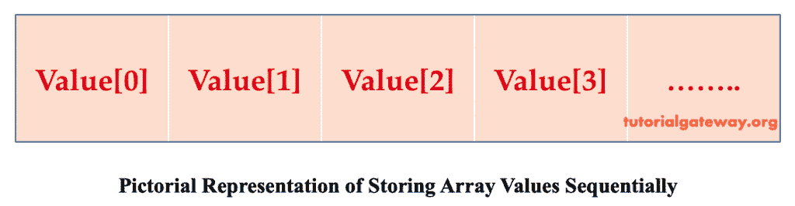

# C# 数组

> 原文：<https://www.tutorialgateway.org/csharp-array/>

直到现在，如果我们想在一个变量中存储多个值，不可能将所有值都存储在一个变量中。但是，我们可以声明一个 C# 数组变量来存储单个数据类型的多个值，而不是声明这么多单独的变量。

C# 数组是用户定义的引用类型的数据类型。C# 数组对于在单个变量中顺序存储相同数据类型的多个值非常有用。

以下是在使用 C# 数组之前应该记住的一些基本事项。

*   数组的大小一旦定义，就不能改变，因此被称为固定大小。
*   一旦定义了它，其中的值就按顺序存储在内存位置。
*   数组中的每个元素都自动用该数据类型的默认值初始化。

例如，

*   如果是 C# 中的整数数组，则其中的所有元素都初始化为 0。
*   如果是布尔类型，所有元素都初始化为 false。
*   如果是字符类型，所有元素初始化为空字符。
*   如果是字符串类型，所有元素都初始化为 null。

因为 C# 数组是引用类型的，所以它们存储在堆内存中。



C# 中的数组一般分为三种类型。

1.  一维的
2.  多维的
3.  参差不齐的

## C# 中的一维数组

C# 中的一维或一维数组是一个可以将数据存储在单行中的线性数组。

### C# 数组声明

让我们看看声明的语法:

```
datatype[] ArrayName = new datatype[size];
```

在这里，new 是一个操作符，它将创建数组，并用默认值初始化数组的所有元素。其次，大小就是它的大小；一旦定义，该值就固定了。

例如

int[]Numbers = new int[5]；其中 5 是数字[]的长度

在这种情况下，用默认值 0 初始化元素。5 是它的大小，一旦定义就固定了。

如果我们想访问或检索其中的单个项目或值，我们必须使用该项目的索引。C# 数组的索引从 0 到 n-1 开始，其中 n 是数组的长度。

这里，数字[5]包含从数字[0]到数字[4]的元素。

### C# 初始化数组

让我们看看在数组中存储值的 C# 语法:

```
ArrayName[index] = value;
```

例如:

numbers[0]= 10；

数字[1]= 30；

数字[2]= 80；

数字[3]= 100；

数字[4]= 70；

这里，默认值 0 被我们用来初始化元素的值覆盖。

### C# 中数组的内联初始化

案例 1:如果我们有固定的值存储在其中，那么我们可以声明一个数组如下:

例如

```
Int[] array1 = new int[4] {3, 6, 8, 2};
```

这里提到的尺寸是 4。如果我们传递的元素数量小于或大于数组的长度或大小，那么它会给你一个语法错误。

因此，我们需要传递大小中提到的相同数量的元素。

情况 2:在不指定元素数量或大小的情况下，我们甚至可以使用内联初始化来声明一个数组。

例如，

```
Int[] array1 = new int[] {10, 2, 6, 4};
```

这里我们没有指定任何大小，所以我们可以传递任意多的元素。然而，一旦我们通过，那将是那个的大小，以后不能改变。

### C# 数组示例

以下示例帮助您理解 C# 中一维数组元素的声明、初始化和打印。

```
using System;

 class program
 {
     public static void Main()
     {
         int[] array1 = new int[5];
         array1[0] = 10;
         array1[1] = 20;
         array1[2] = 40;
         array1[3] = 60;
         char[] array2 = new char[4] {'a', 'n', 'k', 'o'};
         float[] array3 = new float[] { 2.13F, 5, 9.198F, 10.0F, 12};
         Console.WriteLine("Second element in array1 is {0}", array1[1]);
         Console.WriteLine("Fifth element in array1 is {0}", array1[4]);
         Console.WriteLine("First element in array2 is {0}", array2[0]);
         Console.WriteLine("Third element in array3 is {0}", array3[2]);
         Console.ReadLine();
     }
 }
```

输出


分析

array1[]是大小为 5 的整数类型

这里，只有 4 个元素被初始化。第 5 个元素未初始化。

当我们尝试将第二个和第五个元素打印到 [C# ](https://www.tutorialgateway.org/csharp-tutorial/) 控制台时，

通常，第二个元素是 array1[1] =20

第五元素数组 1[4]=0

array2[]是具有四个元素的 char 类型。

array2[0]是 array2 中的第一个元素，即

array3[]是 float 类型，它有五个元素。

数组 3[2]是数组 3 中的第五个元素，即 9.198