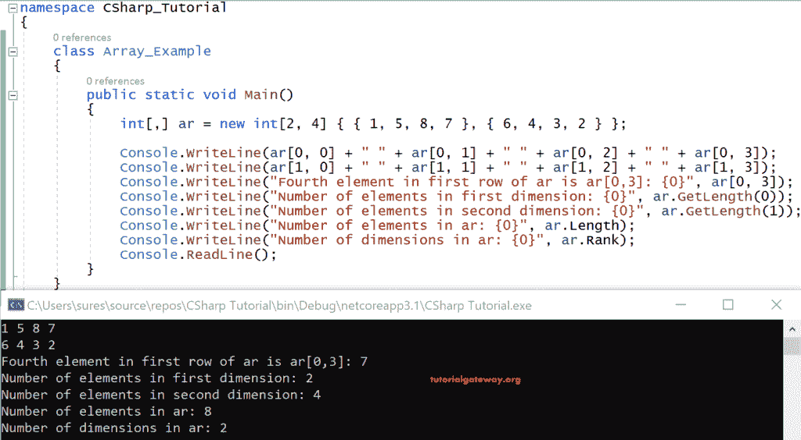

# C#多维数组

> 原文:[https://www . tutorialgateway . org/cs harp-多维-数组/](https://www.tutorialgateway.org/csharp-multi-dimensional-arrays/)

在 C#中，有多个维度的数组被称为多维数组。在 C#中，二维数组是多维数组中最纯粹的形式。在这一节中，我们讨论多维数组。

## C#多维数组语法

对于 C#二维

```
<datatype>[,] = new <datatype>[size];
```

对于 C#三维

```
<datatype>[,,] = new <datatype>[size]; 
.
.
```

C#二维也说是一个矩形，它看起来像

```
Int[,] ar = int[2,3]{{2,3,4}{5,6,7}};
```

Int[2，3]在某种意义上是 2 行 3 列

{2，3，4}是第一行，有三列

{5，6，7}是第二行，有三列

访问 C# 2d 数组，

ar[0，0] = 2

ar[0，1] = 3

ar[0，2] = 4

ar[1，0] = 5

ar[1，1] = 6

ar[1，2] = 7

看起来像是

2 3 4

5 6 7

让我们看一个示例代码来演示多维度。

### C#多维数组示例

为了演示相同的内容，我们在这个例子中使用了 C# 2d 数组。

```
using System;

 class program
 {
   public static void Main()
   {
     int[,] ar = new int[2, 4] { { 1, 5, 8, 7 }, { 6, 4, 3, 2 } };

     Console.WriteLine(ar[0, 0] + " " + ar[0, 1] + " " + ar[0, 2] + " " + ar[0, 3]);
     Console.WriteLine(ar[1, 0] + " " + ar[1, 1] + " " + ar[1, 2] + " " + ar[1, 3]);
     Console.WriteLine("Fourth element in first row of ar is ar[0,3]: {0}", ar[0, 3]);
     Console.WriteLine("Number of elements in first dimension: {0}", ar.GetLength(0));
     Console.WriteLine("Number of elements in second dimension: {0}", ar.GetLength(1));
     Console.WriteLine("Number of elements in ar: {0}", ar.Length);
     Console.WriteLine("Number of dimensions in ar: {0}", ar.Rank);
     Console.ReadLine();
   }
 }
```

输出



分析

在这个 [C#](https://www.tutorialgateway.org/csharp-tutorial/) 例子中，我们取了一个两行四列的二维整数数组。

除了打印这些元素，我们还发现了每个维度的长度。

第一维 ar 的长度。GetLength{0}给出输出 2。

类似地 ar。GetLength{1}为 4。

要知道它的总长度是 ar。输出为 8 的长度。

最后，等级，除了它的维数，就是 ar。排名，显然是 2。