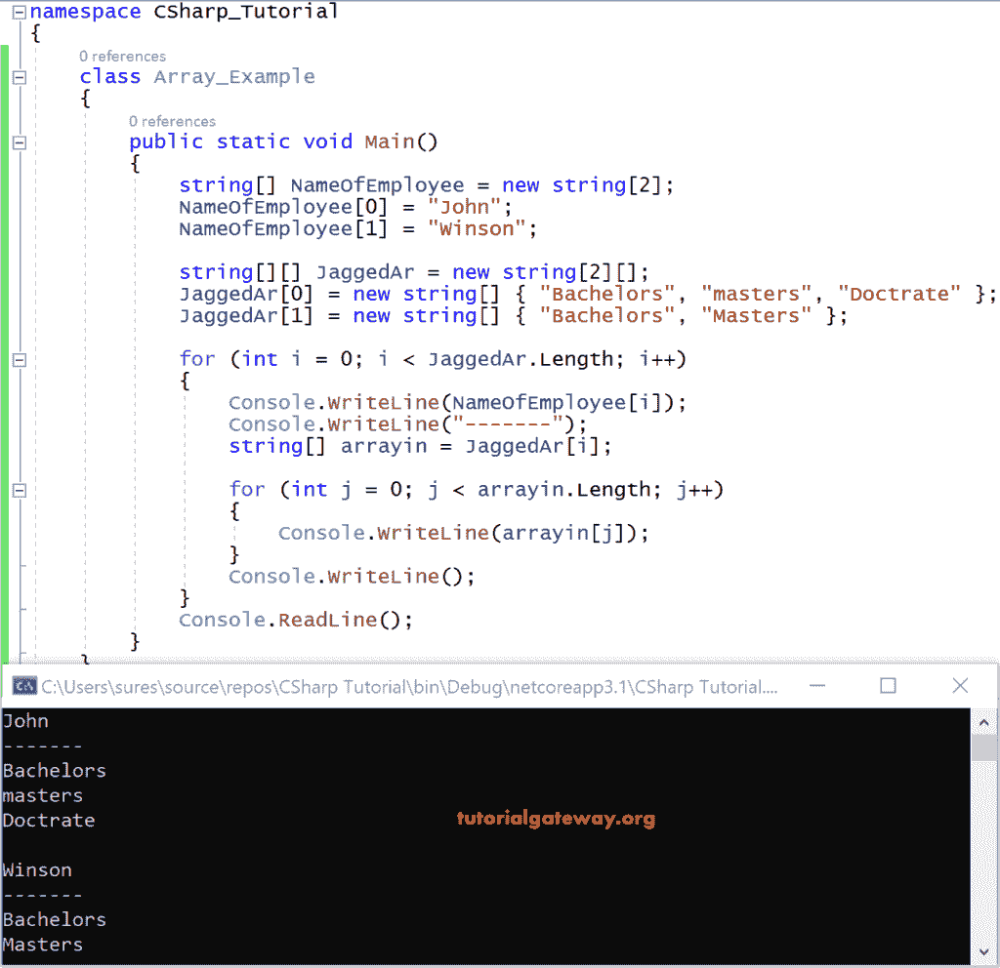

# C#交错数组

> 原文：<https://www.tutorialgateway.org/csharp-jagged-array/>

C# Jagged 是一个数组，它的元素也是一个数组，也就是说，它是一个数组的数组。C#交错数组中的这些元素可以有不同的维度，甚至可以有不同的大小。

C#中的交错数组可以声明和初始化如下:

```
Int[][] JaggedAr = new int[2][];
```

这里 size 2 表示数组的个数，即 JaggedAr[][]中的两个。

在使用 Jagged 之前，我们必须初始化内部的数组。

JaggedAr[0] = new int[]{5，9，6 }；

JaggedAr[1] = new int[]{2，5 }；

让我们看一个在 Jagged 数组上演示的示例代码。

## C#交错数组示例

下面显示的示例向您解释了 C#中 Jagged 数组的声明和使用。

```
using System;

 class program
 {
     public static void Main()
     {
         string[] NameOfEmployee = new string[2];
         NameOfEmployee[0] = "John";
         NameOfEmployee[1] = "Winson";

         string[][] JaggedAr = new string[2][];
         JaggedAr[0] = new string[] { "Bachelors", "masters", "Doctrate" };
         JaggedAr[1] = new string[] { "Bachelors", "Masters" };
         for(int i = 0;i<JaggedAr.Length;i++  )
         {
             Console.WriteLine(NameOfEmployee[i]);
             Console.WriteLine("-------");
             string[] arrayin = JaggedAr[i];

             for(int j = 0; j< arrayin.Length;j++)
             {
                 Console.WriteLine(arrayin[j]);
             }
             Console.WriteLine();
         }

         Console.ReadLine();
     }
 }
```



分析

NameOfEmployee[]是一个字符串数组，其中有两个元素。

JaggedAr[][]是具有两个字符串数组的锯齿。

贾格达[0]有三个要素——学士、硕士、博士。

贾格达[1]有两个要素——学士、硕士。

从贾格达开始。长度为 2，当 i = 0 时，0<2 条件返回真。因此，该控件进入父循环并打印 nameomployye[0 ],这是。

约翰
—

现在 JaggedAr[0]存储在 arrayin[]

当 j=0 时，j

0 <3 returns true. So, [C#](https://www.tutorialgateway.org/csharp-tutorial/) 打印单身汉

同样是 j++，即 1

现在，1 < 3 返回真。所以，它打印大师

同样是 j++，即 2

接下来，2 < 3 返回真，打印博士学位。

同样是 j++，即 3

现在，3 < 3 从子循环返回假

现在控制台。执行 WriteLine()。

同样，它在父循环中递增 I。这次我=1，所以 1<2 返回真。因此进入循环并打印姓名员工[1]，即，

Winson
——

array in = Jagger[1]

j=0 且 j

学士

j++ = 1 且 1<2 返回真。进入子循环并打印 arrayin[1]，即，

主人

j++ = 2 且 2<2 返回 false。所以，它从子循环中出来并执行。

控制台。WriteLine()；

现在将 I 增加 1，所以 i++ = 2

2<2 返回 false，因此脱离父循环。