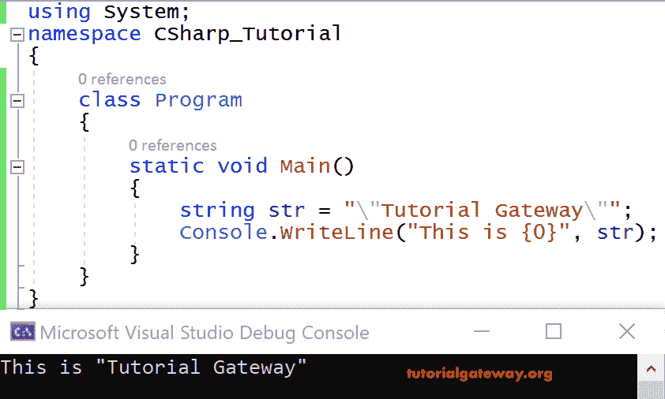

# C# 字符串

> 原文：<https://www.tutorialgateway.org/csharp-string/>

在 C# 中，它是 System 的一个对象。DotNet 框架中的字符串类。字符串类的对象是不可变的(一旦创建就不能更改)。基本上，C# 字符串类型是一系列字符(文本)。

使用关键字字符串创建变量是对该变量或其中的文本进行任何操作的常见做法。但是在 C# 中，字符串也可以用作字符数组。

我们可以说字符串关键字是系统类的别名。因为它是不可变的，可以用不同的方式创建对象:

*   通过创建一个变量并给它赋值。
*   通过使用串联运算符+。
*   使用此类的构造器。
*   调用返回文本或文字的方法。
*   通过调用 Format 方法将值或对象转换为其文本表示形式。

C# 字符串的语法如下所示

```
//declaration
string str;

//initializing to null
string str = null;

//Initializing an empty 
string str = “”;
string str = System.String.Empty;

//Initializing a literal
string path = “C:\\Program Files\\Microsoft SQL SERVER”;

//Initializing a using Verbatim literal to improve readability 
string str = @“C:\Program Files\Microsoft SQL SERVER”;
```

## C# 字符串示例

如果我们想用双引号将文本打印出来。例如(“教程网关”)，那么直接，我们不能使用它们，因为双引号在 [C# ](https://www.tutorialgateway.org/csharp-tutorial/) 中有特殊的含义。使用转义序列\(反斜杠)，我们可以用双引号打印文本。

```
using System;

    class Program
    {
        static void Main()
        {
        string str = "\"Tutorial Gateway\"";
        Console.WriteLine("This is {0}", str);
        }
}
```

输出



以下是 C# 编程语言中显示字符串的各种字符转义序列。

| 换码顺序 | 代表 |
| \a | 铃声(警报) |
| \b | 退格 |
| \f | 换页 |
| \n | 换行 |
| \r | 回车 |
| \t | 横表 |
| \v | 垂直标签 |
| \' | 单引号 |
| \" | 双引号 |
| \\ | 反斜线符号 |
| \? | 字面问号 |
| \ ooo | 八进制符号中的 ASCII 字符 |
| \x hh | 十六进制表示法中的 ASCII 字符 |