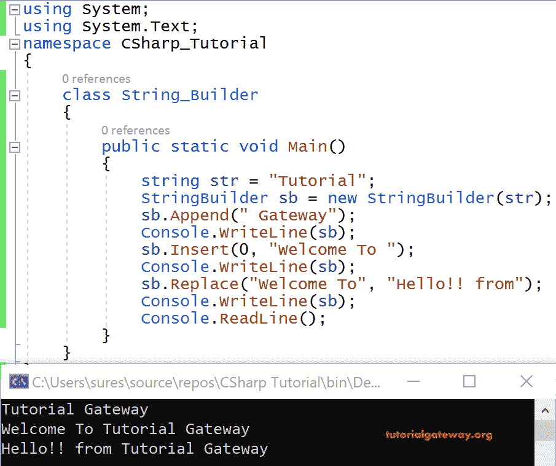
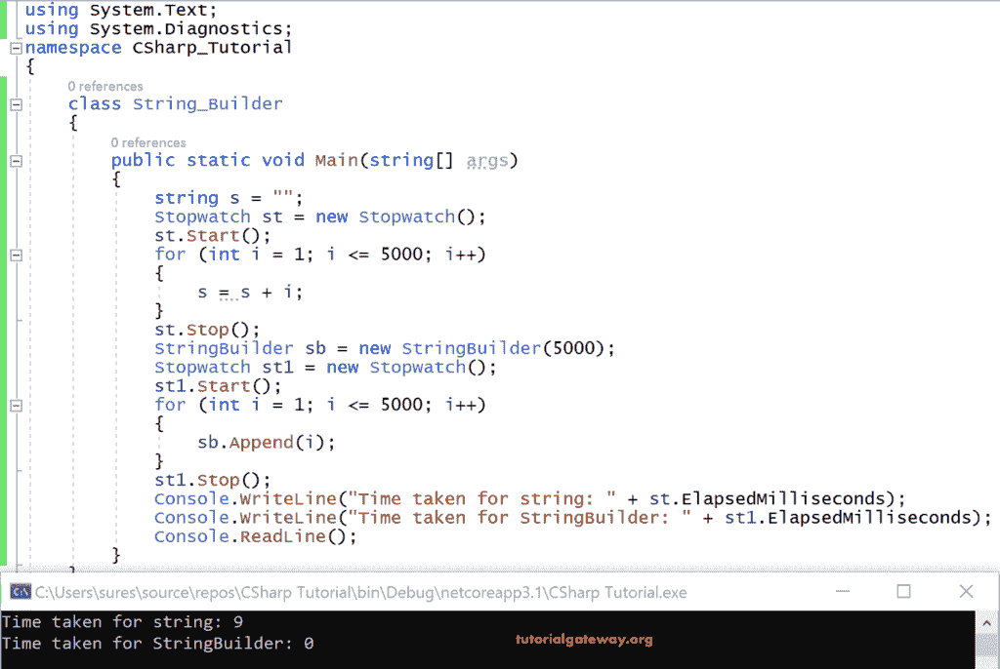

# c# `StringBuilder`

> 原文：<https://www.tutorialgateway.org/c-string-builder/>

C# `StringBuilder`是由 DotNet 框架引入的一个概念，用来克服数据类型字符串的性能问题。正如我们已经知道的，字符串是引用类型的数据类型，即堆内存中为其变量分配的内存。而字符串一旦创建就是不可变的，即不能更改。然而，C# `StringBuilder`是可变的。

让我们看一个字符串的例子来理解区别。比方说

```
string str = "Hello";
```

对于上面的变量值，在堆内存中分配了 5 个字节。接下来，

str = str +“世界”；

因为它是不可变的，所以“世界”不会与原始字符串值连接在一起。

相反，通过在“Hello”后面附加“World”在内存中创建另一个字符串。

堆内存

| 你好
你好世界
你好世界 ABC
。
。 |

这样，如果我们尝试修改 100 次，将在一个堆中维护 100 个副本，一个副本用于原始字符串。总共，它将保留 101 份。

## c# stringbuilder

C# `StringBuilder`是可变的，因为可以对字符串进行更改。`StringBuilder`可从系统中获得。文本命名空间。

C# `StringBuilder`语法:

```
StringBulder sb = new StringBuilder(“string str”); // It creates a stringbuilder with the specified string
```

例如:

```
StringBulder sb = new StringBuilder(“Hello”);
```

这里 sb 是一个 StringBuilder 对象，一开始分配 16 个字节。在对文本进行修改时，它会根据需要将大小增加一倍。

如果我们知道修改文本需要多少内存的确切大小，那么我们可以给出这个大小作为 C# StringBuilder 的参数。

C# `StringBuilder`的语法是

```
StringBuilder sb = new StringBuilder(int length); // It creates an empty stringbuilder with the specified capacity as length
```

例如:

```
StringBuilder sb = new StringBuilder(1000);
```

例如，“Hello”占用 5 个字节，StringBuilder 分配 16 个字节，剩下的 11 个字节用于 [C# ](https://www.tutorialgateway.org/csharp-tutorial/) 字符串的未来修改。

假设“你好”与另一个“世界”相连，即，

```
sb.Append("World");
```

如您所知，Hello World 总共有 11 个字节被占用，剩下 5 个字节为空。

现在一些 ABCDEF 被附加到字符串中

str+= ABCDEF；

Hello World ABCDEF 需要 18 个字节，但只有 16 个字节可用。因此，它增加了两倍的内存时间，即增加到 32 字节。

堆内存

你好世界 ABCDEF

C# `StringBuilder`只在堆内存中维护一个副本，而不管对该变量值进行了多少次更改。

注意:如果需要修改三到四次，那么就去字符串类。如果要对一个字符串进行大量的更改，那么就使用 C# StringBuilder 类。

以下方法对于修改 C# `StringBuilder`很有用:

| 方法名 | 描述 |
| StringBuilder(`StringBuilder`)。附录() | 在当前`StringBuilder`的末尾添加数据 |
| StringBuilder。插入() | 将字符串插入指定索引中的 StringBuilder。 |
| StringBuilder。移除() | 从`StringBuilder`中移除指定数量的字符 |
| StringBuilder。替换() | 替换指定索引中的指定字符 |
| StringBuilder(`StringBuilder`)。附录格式() | 字符串中传递的格式说明符被格式化文本替换 |

### C# `StringBuilder`示例

让我们在 StringBuilder 上演示一个 C# 代码示例。

```
using System.Text;

class program
{
  public static void Main()
  {
    string str = "Tutorial";
    StringBuilder sb = new StringBuilder(str);
    sb.Append(" Gateway");
    Console.WriteLine(sb);
    sb.Insert(0, "Welcome To ");
    Console.WriteLine(sb);
    sb.Replace("Welcome To", "Hello!! from");
    Console.WriteLine(sb);
    Console.ReadLine();
  }
}
```

输出



分析

在这个 C# `StringBuilder`的例子中，字符串是一个用“教程”初始化的字符串变量。

sb 是 StringBuilder 类型对象，字符串作为参数传递给它。

某人（somebody 的简写）追加(“网关”)将在“教程”中追加“网关”

某人（somebody 的简写）插入(0，“欢迎光临”)将在“教程网关”的第 0 个位置插入“欢迎光临”。

某人（somebody 的简写）替换为(“欢迎光临”，“你好！！From”)将“欢迎使用教程网关”中的“欢迎使用”替换为“您好！！从“和指纹

“你好！！来自教程网关”

让我们编写 C# 代码来了解 StringBuilder 类相对于 String 类的性能。

### C# `StringBuilder`示例 2

在这里，我们将找出字符串和 C# StringBuilder 在进行相同次数的迭代时所花费的时间差异。

```
using System;
using System.Text;
using System.Diagnostics;

class program
{
  public static void Main(string[] args)
  {
    string s = "";
    Stopwatch st = new Stopwatch();
    st.Start();
    for (int i = 1; i <= 5000; i++)
    {
      s = s + i;
    }
    st.Stop();
    StringBuilder sb = new StringBuilder(5000);
    Stopwatch st1 = new Stopwatch();
    st1.Start();
    for (int i=1;i<=5000;i++)
    {
      sb.Append(i);
    }
    st1.Stop();
    Console.WriteLine("Time taken for string: " + st.ElapsedMilliseconds);
    Console.WriteLine("Time taken for StringBuilder: " + st1.ElapsedMilliseconds);
    Console.ReadLine();
  }
}
```

输出



分析

这里取了一个空 s。接下来，我们已经获取了一个秒表类，并为它创建了一个实例 st。这个秒表类来自系统。诊断命名空间

st.Start()是在循环开始之前启动秒表

循环的 [C# ](https://www.tutorialgateway.org/csharp-tutorial/) 是用 int i 初始化为 1 编写的，我会迭代 5000 次。每次我用字符串变量连接值

st.Stop()将停止秒表()。

使用 StringBuilder 的相同方法还为`StringBuilder`创建了一个实例 sb，其中 5000 作为参数传递，这意味着 sb 创建了一个长度为 5000 的空字符串。

在循环开始之前，秒表创建了它的实例，并调用 start()

在这里，循环被重复 5000 次，每次我将值附加到它上面。迭代完成后，秒表停止。

最后，我们使用秒表类的属性 ElapsedMilliseconds 分别打印了 String 和 StringBuilder 所花费的时间。

在这里，发现不同！对于 5000 次迭代，字符串需要 20 毫秒，而对于相同的迭代次数，C# `StringBuilder`需要 1 毫秒。