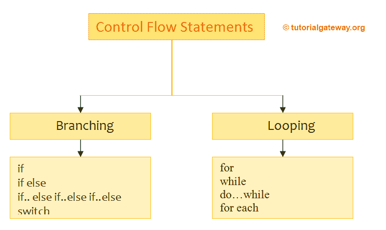
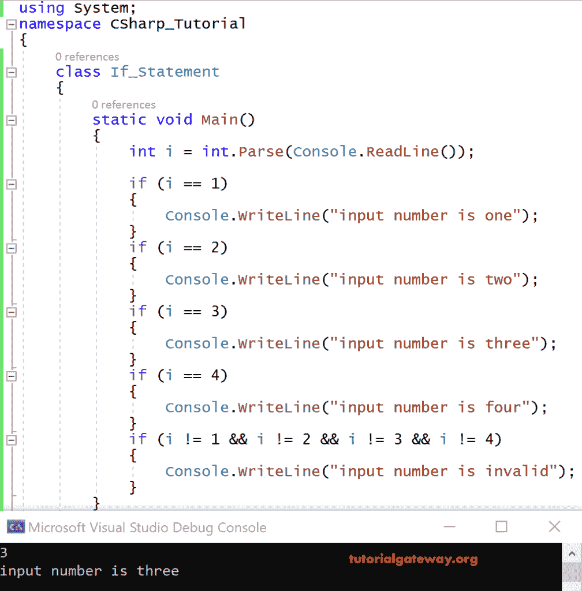

# C# `if`语句

> 原文：<https://www.tutorialgateway.org/csharp-if-statement/>

C# `if`语句:C# 中的控制结构帮助我们控制应用程序代码执行的流程。这些控制流结构分为两种类型——分支和循环。



分支

通过从多个选项中选择一个选项，分支对决策很有用。

如果我们想决定多个选项，我们选择分支语句，如 if、if else 等。

例如，如果我们想检查一个数字是奇数还是偶数。然后我们要根据两个选项来决定，即那个数是否能被 2 整除。

## 简单的 C# `if`语句

只有当`if`语句中指定的条件为真时，C# 中的简单`if`语句才有助于执行代码。C# `if`语句的语法如下所示

```cs
If<condition>
{
   Statements; //These statements are executed if condition is true
}
```

### C# `if`语句示例

在这个 C# `if`语句示例中，我们为以下需求编写代码。

读数字 1 到 4，用文字打印。如果数字不在 1 到 4 之间，则打印为无效数字。

```cs
using System;
class Program
{
    static void Main()
    {
       int i =  int.Parse(Console.ReadLine());

        if (i == 1)
        {
            Console.WriteLine("input number is one");
        }
        if (i == 2)
        {
            Console.WriteLine("input number is two");
        }
        if (i == 3)
        {
            Console.WriteLine("input number is three");
        }
        if (i == 4)
        {
            Console.WriteLine("input number is four");
        }
        if (i != 1 && I != 2 && I != 3 && I != 4)
        {
            Console.WriteLine("input number is invalid");
        }
    }
}
```

输出



分析

在上面的代码中，使用 C# `if`语句，我们将输入的数字与数字 1 到 4 进行了比较。

这里我们用一个整数变量 I 来存储输入数字。自控制台。ReadLine()返回一个字符串，我们使用 Parse.int 显式转换为一个整数

输入的数字为 3

[C# ](https://www.tutorialgateway.org/csharp-tutorial/) 编译器开始用 1、2、3、4 检查数字 3，因此它是 3，它给出如下输出。

输入数字是三

注意:编译器会检查代码中的每一个 if 条件，即使在代码本身的中间满足了条件，也不会存在，也就是说，在上面的示例代码中，i==3。