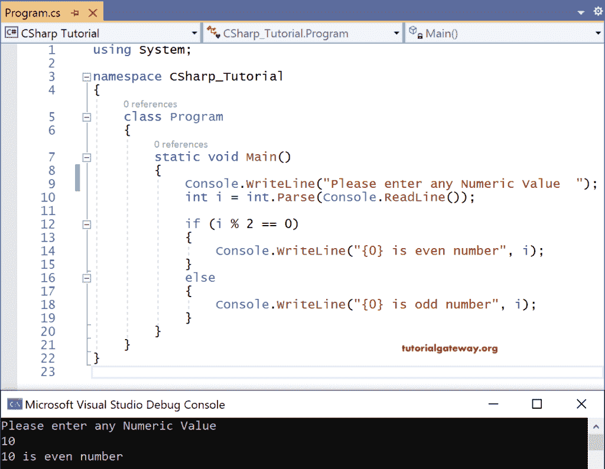

# C#`if-else`语句

> 原文：<https://www.tutorialgateway.org/csharp-if-else-statement/>

C# If else 控制语句有两个块。一个是真块，另一个是假块。如果 if 块中的 case 条件为真，则执行 if 块中的语句，如果为假，则执行 else 块语句。C# if else 的语法是

```
if <condition>
{
   Statements //These statements are executed if the condition is true
}
else
{
   Statements //These statements are executed if the condition is false
}
```

## C#`if-else`语句示例

让我们看一个 if else 的例子，通过找出给定的输入数是偶数还是奇数？

```
using System;

namespace CSharp_Tutorial
{
    class Program
    {
        static void Main()
        {
            Console.WriteLine("Please enter any Numeric Value  ");
            int i = int.Parse(Console.ReadLine());

            if (i % 2 == 0)
            {
                Console.WriteLine("{0} is even number", i);
            }
            else
            {
                Console.WriteLine("{0} is odd number", i);
            }
        }
    }
}
```

输出



在上面的 [C#](https://www.tutorialgateway.org/csharp-tutorial/) 代码中，我们取了整型变量 I

自控制台。ReadLine()返回一个字符串，我们使用 Parse.int


显式转换为一个整数

输入的数字是 93

由于 93%2 = 1，输出为

93 是奇数