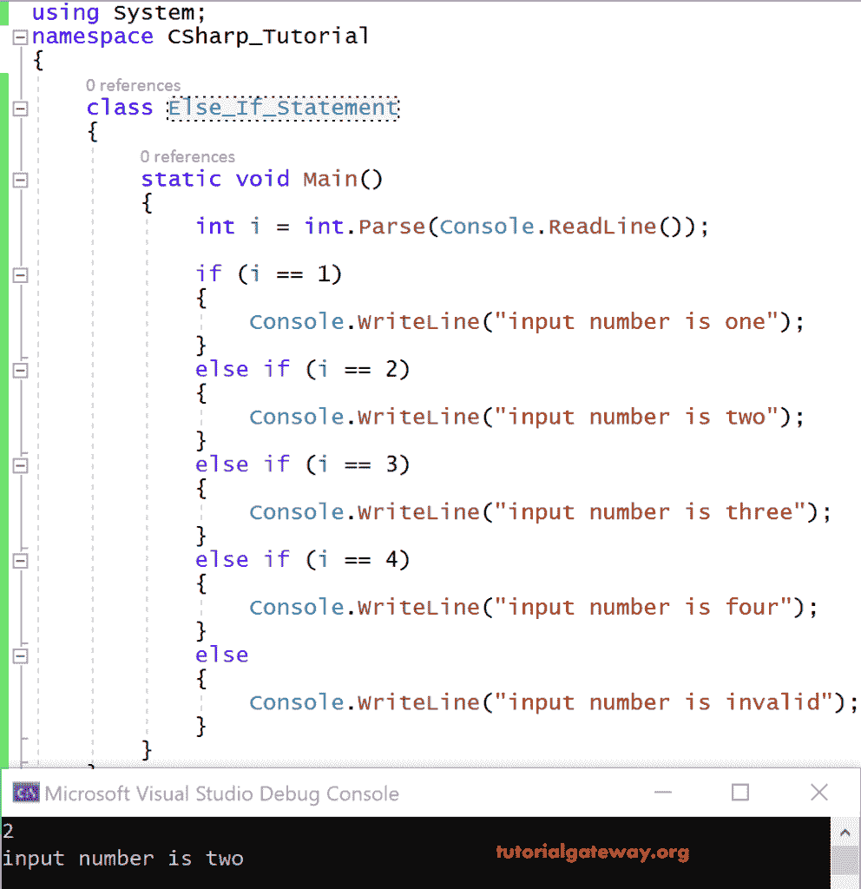

# C# `else if`语句

> 原文：<https://www.tutorialgateway.org/csharp-else-if-statement/>

通过使用 C# `else if`语句，我们可以提高简单`if`语句的执行速度。这意味着当我们使用 C# Else if 控制流语句时，编译器将只检查序列中的所有比较，直到满足给定的条件。一旦条件满足，它将自己退出，而不是进行下一次比较。

## C# 否则如果语法

否则 if 控制语句将克服简单 if 表达式的性能问题。这个 C# `else if`语句背后的语法如下所示

```
if <condition>
{
  Statements //These are executed if condition is true
}
else if <condition>
{
  Statements //These are executed when this else if condition is true
}
else if <condition>
{
  Statements //These sare executed when this else if condition is true
}
else
  <Default statements> //These are executed in case when neither of the above conditions is true. 
```

### C# 否则如果示例

让我们用`else if`语句写一个简单的例子。这与您在 [if 条件](https://www.tutorialgateway.org/csharp-if-statement/)中看到的例子相同。

这个 [C# ](https://www.tutorialgateway.org/csharp-tutorial/) 的例子从 1 到 4 读取数字并用文字打印。如果用户给定的数字不在 1 到 4 之间，则打印为无效数字。

```
using System;
class Program
{
    static void Main()
    {
        int i = int.Parse(Console.ReadLine());

        if (i == 1)
        {
            Console.WriteLine("input number is one");
        }
        else if (i == 2)
        {
            Console.WriteLine("input number is two");
        }
        else if (i == 3)
        {
            Console.WriteLine("input number is three");
        }
        else if (i == 4)
        {
            Console.WriteLine("input number is four");
        }
        else
        {
            Console.WriteLine("input number is invalid");
        }
    }
}
```

输出



分析

这里给出 i = 2 作为输入。

首先，它检查 2==1，这是假的。

2==2 返回真

因此它会打印:输入数字是 2

它退出循环，不执行下一行。